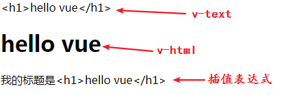
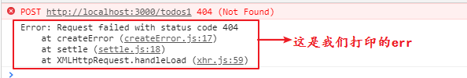
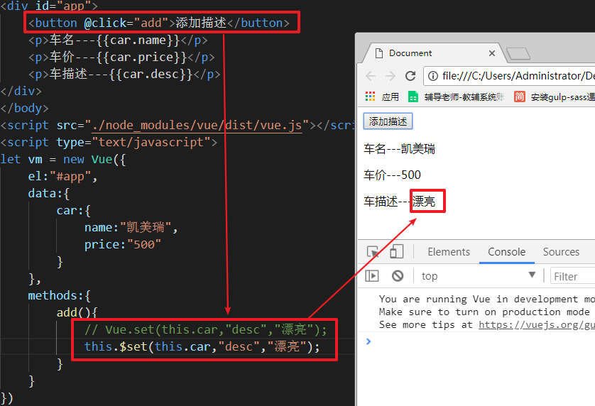
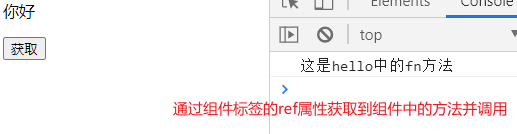
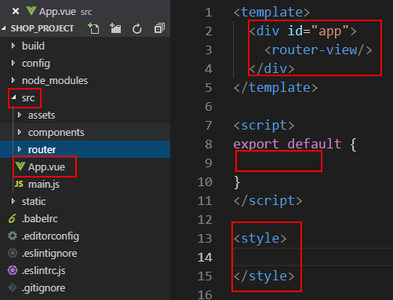
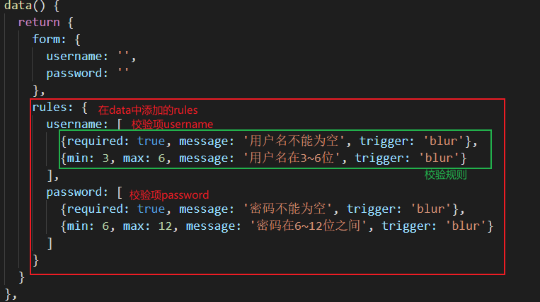

# Vue

## 简介

概念：渐进式javascript框架

官网：cn.vuejs.org

作者：尤雨溪，中国人，从小在国外长大，最近加入了阿里巴巴团队。

特性：易用、灵活、高效。

库和框架：

​	库：一系列方法的集合，使用的时候引入文件、调用其中的方法即可。jQuery、zepto、art-template

​	框架：一套完整的技术解决方案，主体逻辑由框架控制。vue、react、angular、bootstrap、mui

​	框架包含库。

​	参考：https://zhuanlan.zhihu.com/p/26078359?group_id=830801800406917120

设计模式：

vue使用的是mvvm的设计模式。

mvc设计模式

- MVC是一种软件架构模式，也有人叫做设计模式
- M: Model 数据模型（专门用来操作数据，数据的CRUD）
- V：View 视图（对于前端来说，就是页面）
- C：Controller 控制器（是视图和数据模型沟通的桥梁，用于处理业务逻辑）

| mvc设计模式示意图                         |
| ----------------------------------------- |
|  |

mvvm设计模式：

MVVM，一种更好的UI模式解决方案。

- M：model数据模型(ajax获取到的数据)
- V：view视图（页面）
- VM：ViewModel 视图模型

| mvvm架构                                  |
| ----------------------------------------- |
|  |

MVVM通过`数据双向绑定`让数据自动地双向同步

- V（修改视图） -> M（数据自动同步）
- M（修改数据） -> V（视图自动徒步）

Vue中的MVVM

虽然没有完全遵循 MVVM 模型，Vue 的设计无疑受到了它的启发。因此在文档中经常会使用 vm (ViewModel 的简称) 这个变量名表示 Vue 实例

vue使用注意事项：

**1. 在vue中，不推荐直接手动操作DOM！！！** 

**2. 在vue中，通过数据驱动视图，不要在想着怎么操作DOM，而是想着如何操作数据！**

## 初体验

下载安装使用：

地址：http://vuejs.com/

```html
<!-- 开发环境版本，包含了有帮助的命令行警告 -->
<script src="https://cdn.jsdelivr.net/npm/vue/dist/vue.js"></script>
```

或

```html
<!-- 生产环境版本，优化了尺寸和速度 -->
<script src="https://cdn.jsdelivr.net/npm/vue"></script>
```

或者使用node进行下载：

```shell
# 最新稳定版
$ npm install vue
```

然后引入核心文件vue.js即可。注意：不引入压缩版，因为压缩版取消了错误提示等功能，不利于开发，适用于上线使用。

使用步骤：

1. 引入vue.js文件

   ```html
   <script src="vue.js"></script>
   ```

   

2. 创建vue实例

   ```js
   const vm = new Vue({
       // el 用于指定vue管理的范围
       el:"#app",
       // data 用于指定在vue中要使用的数据
       data:{
           msg:"hello vue",
       }
   });
   ```

   

3. 在页面中使用vue中的数据，使用双大括号

   ```html
   <div id="app">
       <h1>
           {{msg}}
       </h1>
       <p>
           {{msg}}
       </p>
   </div>
   ```

例：

```html
<!DOCTYPE html>
<html lang="en">
<head>
	<meta charset="UTF-8">
	<title>Document</title>
</head>
<body>
	<div id="app">
		<h1>{{msg}}</h1>
		<p>{{msg}}</p>
	</div>
</body>
<script src="./node_modules/vue/dist/vue.js"></script>
<script>
const vm = new Vue({
	el:"#app",
	data:{
		msg:"hello vue!",
	},
});
</script>
</html>
```

效果：

| vue初体验                                 |
| ----------------------------------------- |
|  |

使用说明：

实例化vue模型时，传入的对象中的两个参数名称是固定的：el和data，不能自定义，el的值代表的是标签元素，可以用id指定元素，也可以用class指定元素。vue指定的范围不能是html标签或者body标签上面，只能是在body中的设置的标签。

| 控制台的操作                              |
| ----------------------------------------- |
|  |

## 插值表达式

在vue中`{{}}`叫做插值表达式，也叫作小胡子表达式，专业点叫做`mustache表达式`，主要用于显示data中的数据

插值表达式需要注意的事项;

1. 可以访问data中的数据
2. 可以出现一个表达式（三元表达式，数组.数组方法，加减乘除）
3. 不能访问data中不存在的属性
4. 不能出现语句（js的关键字）

例：

```html
<body>
	<div id="app">
		<p>{{msg}}</p>
		<p>{{age + 1}}</p>
		<p>{{car.brand}} -----》{{car.price}}</p>
		<p>{{age>18?"成人":"未成年"}}</p>
		<p>{{["张三","18岁"].join("==")}}</p>
		<p>{{"haha"}}</p>
		<p>{{haha}}</p> <!-- 报错，haha is not defined -->
	</div>
</body>
<script src="./node_modules/vue/dist/vue.js"></script>
<script>
const vm = new Vue({
	el:"#app",
	data:{
		msg:"hello vue!",
		age:20,
		car:{
			brand:"forever",
			price:"￥500.00",
		},
	},
});
</script>
```

vue为了让我们访问数据方便，将data里面的数据都绑定到了vm上

| 方便的访问数据                            |
| ----------------------------------------- |
|  |


## vue指令

vue指令其实就是标签中一个属性，具有特殊含义的指令。

### v-bind指令

插值表达式不支持写在标签的属性中，只能写在标签的内容中。所以如果要将插值表达式应用在标签的属性中，需要使用特殊的方式：v-bind指令。

```html
<body>
	<div id="app">
		<p>
			<!-- 插值表达式不能应用在标签属性中，所以不解析 -->
			
			<!-- 使用v-bind让属性中可以解析data中的数据 -->
			
		</p>
	</div>
</body>
<script src="./node_modules/vue/dist/vue.js"></script>
<script>
const vm = new Vue({
	el:"#app",
	data:{
		imgUrl:"images/1.png",
		title:"小仓优子",
	},
});
</script>
```

<font color="red">**注意：因为v-bind很常用，所以通常会省略v-bind，在属性名前加冒号即可在属性值中使用data的数据**</font>

```html

```

在属性值中使用的数据同样可以是一个表达式：

```html

```

### v-model指令

v-model设置在表单上，主要用于实现数据的双向绑定（表单元素的value值发生了改变，数据自动发生改变；数据发生改变，表单元素的value值也会发生改变）。也就是`view---->model`和`model---->model`。这就是数据的双向绑定。

```html
body>
	<div id="app">
		<p>{{msg}}</p>
		<input type="text" name="username" v-model="msg">
	</div>
</body>
<script src="./node_modules/vue/dist/vue.js"></script>
<script>
const vm = new Vue({
	el:"#app",
	data:{
		msg:"请输入用户名"
	},
});
</script>
```

效果图：

| v-model数据双向绑定                       |
| ----------------------------------------- |
|  |

使用说明：

​	一个表单元素，只要使用了v-model，value属性就不作考虑了。

其他表单元素上使用v-model

```html
<body>
	<div id="app">
		<p>{{msg}}</p>
		<input type="text" name="username" v-model="msg">
		<br>
		<p>性别男：{{ischecked}}</p>
		<input type="checkbox" name="hobby" v-model="ischecked">游泳
		<br>
		<p>城市码：{{cityCode}}</p>
		<select name="city" v-model="cityCode">
			<option value="1">北京</option>
			<option value="2">上海</option>
			<option value="3">深圳</option>
		</select>
		<br>
		<p>文本域内容：{{message}}</p>
		<textarea name="msg" v-model="message" cols="30" rows="10"></textarea>
	</div>
</body>
<script src="./node_modules/vue/dist/vue.js"></script>
<script>
const vm = new Vue({
	el:"#app",
	data:{
		msg:"请输入用户名",
		ischecked:true,
		cityCode:2,
		message:"请输入留言",
	},
});
</script>
```

效果：

| 其他元素使用v-model                       |
| ----------------------------------------- |
|  |

vue为了使用方便，会将data中的数据都绑定到vm上，所以，在控制台中可以使用vm.msg来访问vm.$data.msg数据

### 数据双向绑定的原理

input使用oninput事件监听内容的改变，data对象使用数据劫持来监听对象值的改变。（angular使用的是脏数据检查机制----轮询策略）

数据劫持原理使用的是Object.defineProperty方法：

```js
var obj = {
    name:"zhangsan",
    age:12
}
/*
	参数1：定义哪个对象的属性
	参数2：属性名称
	参数3：修饰
*/
Object.defineProperty(obj,"name",{
    enumerable:false, // 设置不允许遍历到这个属性
    writable:false, // 设置不允许修改这个属性
    // 劫持这个对象的获取这个属性的操作，每次获取这个对象的这个属性都会被get劫持
    get(){
		console.log("被劫持到了name属性");
    },
    // 劫持到了这个对象的设置这个属性的操作，设置的值也会被劫持到
    set(value){
        console.log("设置操作被劫持了，值为",value);
    }
});
```

访问效果：

| 数据劫持效果                              |
| ----------------------------------------- |
|  |

使用说明：使用get和set方法就不能设置enumerable和writable属性。

简单实现v-model的原理：

```html
<!DOCTYPE html>
<html lang="en">
<head>
	<meta charset="UTF-8">
	<title>Document</title>
</head>
<body>
	<p></p>
	<input type="text">
</body>
<script>
var obj = {
	msg:"请输入用户名"
}
// 使用监听input输入的事件进行实时监听（选择使用oninput事件，因为onchange事件需要失去焦点才能触发一次，而oninput事件可以一直触发）
var oP = document.querySelector("p");
var oInput = document.querySelector("input");
oP.innerHTML = obj.msg;
oInput.value = obj.msg;
oInput.addEventListener("input",function(){
	obj.msg = oInput.value;
});
var tmp = obj.msg;
Object.defineProperty(obj,"msg",{
	get(){ // 相当于get属性是个方法，例：get:function(){}
		return tmp;
	},
	set(value){
		tmp = value;
		oP.innerHTML = tmp;
		oInput.value = tmp;
	}
});
</script>
</html>
```

效果：

| v-model大致原理                           |
| ----------------------------------------- |
|  |

这是介绍了vue的v-model的大致原理，其实在vue中完整的实现还用到了发布订阅者模式，也叫作观察者模式，是设计模式中的一种，共23种设计模式。

### v-on指令

v-on指令的作用是给元素绑定事件。语法：`v-on:事件名="方法名"`

```html
<body>
	<div id="app">
		<button v-on:click="myClick">按钮</button>
	</div>
</body>
<script src="./node_modules/vue/dist/vue.js"></script>
<script>
const vm = new Vue({
	el:"#app",
	data:{
		msg:"hello vue",
	},
	// methods 用于提供vue中使用到的方法。
	methods:{
		myClick(){
			// 在vue内部，为了访问vue的数据方便，methods中所有方法内部的this都绑定到了vm上面，所以在方法内部，this就代表vm，那么this.msg就是data.msg
			console.log(this.msg);
		}
	},
});
</script>
```

效果：

| v-on指令                                  |
| ----------------------------------------- |
|  |

因为事件也很常用，所以，通常会将v-on:事件名简写为`@事件名`

```html
<button @mouseover="myMouse">按钮1</button>
```

js里面的vm里面定义的方法：

```js
methods:{
		myClick(){
			// 在vue内部，为了访问vue的数据方便，methods中所有方法内部的this都绑定到了vm上面，所以在方法内部，this就代表vm，那么this.msg就是data.msg
			console.log(this.msg);
		},
		myMouse(){
			console.log("鼠标放到按钮1上了");
		}
	},
```

效果：

| v-on指令的简写方式                        |
| ----------------------------------------- |
|  |

事件调用的函数传参：

```shell
@事件名="事件的函数名" 可以通过e获取到事件对象
@事件名="函数的调用" 如果函数写的是函数的调用的方式，所有参数都需要手动传递，包括事件对象，传递事件对象使用$event来传递
```

例：

html代码：

```html
<button @click="del">删除1</button>
<button @click="del(3, 'zs', $event)">删除2</button>
```

vue代码：

```js
methods: {
    del(id, name, e) {
        console.log(id, name, e)
    }
}
```

### 事件修饰符

事件修饰符用来阻止默认事件、阻止事件冒泡、设置事件在捕获阶段执行、设置只有自己能触发事件（点击子元素不能触发）、设置事件只能触发一次

```shell
语法：
@事件名.修饰符="方法名"
```

修饰符：

1. prevent表示阻止默认事件
2. stop表示阻止事件冒泡
3. capture表示在事件捕获阶段执行
4. self表示只有自己能触发事件
5. once表示事件只触发一次

修饰符可以链式使用，表示修饰符同时生效

例：

```html
<body>
	<div id="app">
		<div @click="father">
			<a href="#" @click.prevent.stop="son">按钮</a>
		</div>
	</div>
</body>
<script src="./node_modules/vue/dist/vue.js"></script>
<script>
const vm = new Vue({
	el:"#app",
	data:{
		msg:"hello vue",
	},
	// methods 用于提供vue中使用到的方法。
	methods:{
		father(){
			console.log("div的点击事件");
		},
		son(){
			console.log("a标签的点击事件");
		}
	},
});
</script>
```

效果：

| 事件修饰符                                |
| ----------------------------------------- |
|  |

### 按键修饰符

在监听键盘事件时，我们经常需要检查常见的键值。Vue 允许为 `v-on` 在监听键盘事件时添加按键修饰符： 

例：

```html
<body>
	<div id="app">
		<!-- 用法1：@事件名.键盘修饰符(数字)="事件处理函数" -->
		<input type="button" @keyup.13="fn1" v-model="btn1">
		<!-- 用法2：@事件名.键盘修饰符的别名="事件处理函数" -->
		<input type="text" @keyup.esc="fn2" v-model="text1">
		<!-- 用法3：自己起别名并参照用法2使用 -->
		<input type="text" @keyup.huiche="fn3" v-model="text2">
	</div>
</body>
<script src="./node_modules/vue/dist/vue.js"></script>
<script>
// 将回车键系统起的名字enter改成了自己起的名字huiche
Vue.config.keyCodes.huiche = 13;
const vm = new Vue({
	el:"#app",
	data:{
		btn1:"按钮1",
		text1:"内容1",
		text2:"内容2",
	},
	methods:{
		fn1(e){
			this.btn1 = "b1";
			console.log("按下了回车键，将'按钮1'改成了'b1'");
		},
		fn2(){
			this.text1 = "t1";
			console.log("按下了esc键，将'内容1'改成了't1'");
		},
		fn3(){
			this.text2 = "t2";
			console.log("按下了回车键，将'内容2'改成了't2'");
		}
	},
});
</script>
```

如果在事件中需要阻止默认事件或者阻止冒泡等操作，直接在键盘修饰符后面使用事件修饰符即可。

​	如：`@keyup.13.prevent="fn"`

vue默认给一些常用的按键起了名字：

```shell
.enter
.tab
.delete (捕获“删除”和“退格”键)
.esc
.space
.up
.down
.left
.right
```

### v-text和v-html指令

这两个指令都是设置标签的内容，v-html可以解析内容中的标签，v-tex不能解析标签

```html
<body>
	<div id="app">
		<p v-text="msg">段落1</p>
		<p v-html="msg">段落2</p>
		<p>我的标题是{{msg}}</p>
	</div>
</body>
<script src="./node_modules/vue/dist/vue.js"></script>
<script>
const vm = new Vue({
	el:"#app",
	data:{
		msg:"<h1>hello vue</h1>",
	},
});
</script>
```

效果：

| v-text和v-html                            |
| ----------------------------------------- |
|  |

使用说明：

1. v-text使用频率更高一点，因为v-html可能会收到XSS攻击
2. 当标签中的内容都由vue加载，则用v-text；如果标签的部分内容由vue加载，则使用插值表达式

### v-show和v-if指令

这两个指令用来控制元素的显示隐藏，这两个属性的值是布尔值

```html
<body>
	<div id="app">
		<p v-show="isShow">{{msg}}</p>
		<p v-if="isIf">{{msg}}</p>
	</div>
</body>
<script src="./node_modules/vue/dist/vue.js"></script>
<script>
const vm = new Vue({
	el:"#app",
	data:{
		msg:"hello vue",
		isShow:false,
		isIf:false,
	},
});
</script>
```

这两个元素都会隐藏，但是隐藏的方式不一样，v-show是使用样式`display:none`来设置显示隐藏的，而v-if使用的是创建和删除节点来控制的。

| v-show和v-if的区别                        |
| ----------------------------------------- |
|  |

这两个都能设置显示隐藏，但如果是让元素只显示或隐藏一次的话，使用v-if性能会更好一点，因为标签就不用加载了，但如果让元素影藏显示多次的话，就使用v-show，因为使用v-if不停的创建删除节点性能会受到影响。

### v-else和v-else-if指令

v-else和v-else-if指令类似于js中的判断语句中的用法，但是这两个属性都必须跟在v-if的后面

```html
<body>
	<div id="app">
		<p v-if="age >= 18">可以去网吧上网</p>
		<p v-else-if="age >= 16">可以偷偷去网吧上网</p>
		<p v-else-if="age >= 12">可以去网吧看人上网</p>
		<p v-else>抓住会被打的</p>
	</div>
</body>
<script src="./node_modules/vue/dist/vue.js"></script>
<script>
const vm = new Vue({
	el:"#app",
	data:{
		msg:"hello vue",
		age:20,
	},
});
</script>
```

<font color="red">**注意：v-if必须是v-else或v-else-if的上一个元素，否则会报错**</font>

### v-for指令

v-for指令用于循环展示一个对象或者数组中的元素

循环数组：

```html
<body>
	<div id="app">
		<ul>
			<li v-for="item in arr">{{item}}</li>
		</ul>
	</div>
</body>
<script src="./node_modules/vue/dist/vue.js"></script>
<script>
const vm = new Vue({
	el:"#app",
	data:{
		arr:["范冰冰","赵丽颖","杨幂","唐嫣"],
	},
});
</script>
```

效果：

| 遍历数组中的元素                          |
| ----------------------------------------- |
|  |

循环对象：

```html
<body>
	<div id="app">
		<ul>
			<li v-for="(item,k) in obj">{{k}}------》{{item}}</li>
		</ul>
	</div>
</body>
<script src="./node_modules/vue/dist/vue.js"></script>
<script>
const vm = new Vue({
	el:"#app",
	data:{
		obj:{
			name:"张三",
			age:15,
			hobby:"美女",
		},
	},
});
</script>
```

效果：

| 遍历对象                                  |
| ----------------------------------------- |
|  |

其实，不管是数组还是对象，都是可以有下标的，语法：

```html
<ul>
	<li v-for="(v,i) in list">{{k}}---{{v}}</li>
</ul>
```

通常在项目中我们会动态创建元素，也就是说可能会在列表中动态添加一项列表，那么对于之前给列表项绑定的一些操作可能会产生错误，所以，我们会在列表项上再绑定一个属性，作为元素的唯一标识符：

```html
<div v-for="item in items" :key="item.id">
  <!-- 内容 -->
</div>
<!-- 
	如果是对象，通常会将对象的id作为唯一标识符，如果是数组，通常会将数组的元素作为唯一标识符，因为数组的下标会随着数组添加元素发生改变
-->
```

<font color="red">**注意：给标签绑定唯一标识符的属性名必须是key**</font>

### 样式操作

vue为了我们操作样式方便且不用操作dom元素，所以在v-bind的基础上对class属性和style属性做了增强：使用对象作为类名和style的样式做操作

```html
<body>
	<style>
		.box{
			width:100px;
			height:100px;
			border:1px solid #000;
		}
		.bg{
			background-color:red;
		}
	</style>
	<div id="app">
		<p :class="classObj"></p>
		<p :class="{box:true,bg:true}"></p>
		<p :style="styleObj"></p>
		<p :style="{width:'100px',height:'100px',backgroundColor:'green'}"></p>
	</div>
</body>
<script src="./node_modules/vue/dist/vue.js"></script>
<script>
const vm = new Vue({
	el:"#app",
	data:{
		classObj:{
			box:true,
			bg:true,
		},
		styleObj:{
			width:'100px',
			height:'100px',
			'background-color':'yellow', // 或者将键写为驼峰命名：backgroundColor
		},
	},
});
</script>
```

效果：

| class操作和style操作                      |
| ----------------------------------------- |
|  |

以后再操作样式发生改变的时候，不用再操作dom，只需要操作这个对象即可。

## todomvc案例

### 第一步：下载模板并创建vue实例

首先下载模板，下载地址：<https://github.com/tastejs/todomvc-app-template>

下载依赖的css，在package.json所在的文件夹中执行命令：`npm i`

在index.html中引入vue

```html
<script src="node_modules/vue/dist/vue.js"></script>
```

在app.js中初始化vue实例：

```js
const vm = new Vue({
    el:".todoapp",
    data:{

    }
});
```

### 第二步：初始化数据

在data中存放所有todo任务

```js
data:{
    // 存放所有todo任务
    list:
    [
        {
            id:1,
            name:"吃饭",
            completed:false,
        },
        {
            id:2,
            name:"睡觉",
            completed:false,
        },
        {
            id:3,
            name:"打豆豆",
            completed:false,
        },
    ]
}
```

在模板中动态渲染任务：

1. 使用`v-for`指令遍历`list`的数据，为了保证唯一，要添加`key`属性
2. 控制每个`li`的内容，动态渲染`{{item.name}}`
3. 控制每个`li`的`completed`类，如果`item.completed`为`true`，应该要有completed类：`v-bind:class="{completed:item.completed}"`
4. `checkbox`默认全选中，控制`checkbox`的选中状态。`checkbox`是一个表达元素，所以`v-model`实现双向数据绑定

```html
<!-- 
    li有completed类表示任务是完成状态
    li有editing类表示任务是编辑状态
    :class="{completed:item.completed}表示如果item.completed为true时，表示任务已完成
-->
<li :class="{completed:item.completed}" v-for="item in list" :key="item.id">
    <div class="view">
        <input class="toggle" type="checkbox" v-model="item.completed">
        <label>{{item.name}}</label>
        <button class="destroy"></button>
    </div>
    <input class="edit" value="Create a TodoMVC template">
</li>
```

### 第三步：添加任务

添加任务，首先进行input的双向绑定，并添加键盘弹起的事件

```html
<!-- 为了获取到input框的内容，使用v-model进行双向绑定 -->
<input class="new-todo" placeholder="What needs to be done?" v-model="todoName" @keup="addTodo" autofocus>
```

然后在data中添加数据todoName，并设置addTodo函数进行处理添加任务

```js
	todoName:"",
},
    methods:{
        // 添加新任务
        addTodo(e){
            if(e.keyCode != 13) return
            // 直接通过this.todoName就获取输入的任务名字，加入到list中
            this.list.unshift({
                id:+new Date(), // 为了保证唯一，直接做成了时间戳
                name:this.todoName,
                completed:false,
            });
            this.todoName = "";
        }
    },
```

### 第四步：删除任务

给删除按钮绑定事件，并传入参数---要删除的这一项的id

```html
<div class="view">
    <input class="toggle" type="checkbox" v-model="item.completed">
    <label>{{item.name}}</label>
    <!-- 给删除按钮绑定事件 -->
    <button class="destroy" @click="delTodo(item.id)"></button>
</div>
```

在methods中设置事件处理删除操作：

```js
// 删除任务
delTodo(id){
    // 通过id找到这一项在数组中对应的下标
    let idx = this.list.findIndex(item=>{
        return item.id == id
    });
    // 根据下标删除数组中对应的这一项
    this.list.splice(idx,1);
}
```

如果没有任务了，则不应该显示底部了，所以应该给底部添加`v-show`指令：

```html
<footer class="footer" v-show="list.length > 0">
```

### 第五步：修改任务

双击任务，给li添加`editing`类名，表示编辑状态，通过设置一个数据和id进行相等的判断设置editing类名

```html
<li :class="{completed:item.completed,editing:item.id == clickId}" v-for="item in list" :key="item.id" @dblclick="showEdit(item.id)">
```

设置双击方法，显示双击后的编辑状态

```js
// data中新添加的属性
clickId:-1,
// 显示编辑状态的方法
// 显示修改框
showEdit(id){
    this.clickId = id;
},
```

双击后让`clickId = item.id`，条件满足后editing类的值就是true，相当于给li添加了editing类

然后给编辑的文本框设置键盘事件，并传入参数，进行修改：

```html
<input @keyup.enter="editTodo(item.id)" class="edit" v-model="item.name">
```

设置编辑方法处理编辑任务：

```js
// 修改任务
editTodo(id){
    // 将clickId改为-1即可取消编辑类
    this.clickId = -1;
}
```

### 第六步：未完成任务数量

直接给数量的标签中设置一个数量，使用filter方法得到所有未完成任务组成的数组，求出个数

```html
<span class="todo-count"><strong>{{list.filter(item=>!item.completed).length}}</strong> item left</span>
```

插值表达式中可以写表达式，但是逻辑比较复杂的情况下，不利于后期维护，建议换成计算属性：

使用计算属性优化未完成数量的任务：

html代码：

```html
<span class="todo-count"><strong>{{leftCount}}</strong> item left</span>
```

js代码：

```js
computed:{
    // 剩余未完成任务的数量
    leftCount(){
        let undone = this.list.filter(function(item){
            return !item.completed
        });
        return undone.length;
    }
}
```

### 第七步：删除全部完成任务

- 控制清空全部按钮的显示隐藏，也要通过计算属性得到：只要有一个已完成的任务就显示，否则隐藏

  html代码：

  ```html
  <button v-show="showClearBtn" class="clear-completed">Clear completed</button>
  ```

  js代码：

  ```js
  // 控制显示隐藏删除全部按钮
  showClearBtn(){
      return this.list.some(item=>item.completed);
  }
  ```

  

- 给清空全部按钮绑定点击事件删除完成的任务

  html代码：

  ```html
  <button @click="clearAll" v-show="showClearBtn" class="clear-completed">Clear completed</button>
  ```

  js代码：

  ```js
  // 删除全部完成任务
  clearAll(){
      this.list = this.list.filter(item=>!item.completed);
  }
  ```

## vue的计算属性

计算属性其实和data一样，也是vue模型的属性，也是给vue提供数据的，只不过怕属性叫做computed，并且computed里面的值是一个函数，因为里面的值需要通过data中的值进行计算：

```html
<body>
	<div id="app">
		<input type="text" v-model="n1">
		+
		<input type="text" v-model="n2">
		=
		<span>{{n3}}</span>
	</div>
</body>
<script src="./node_modules/vue/dist/vue.js"></script>
<script>
// 将回车键系统起的名字enter改成了自己起的名字huiche
Vue.config.keyCodes.huiche = 13;
const vm = new Vue({
	el:"#app",
	data:{
		n1:'',
		n2:'',
	},
	computed:{
		n3:function(){
			return +this.n1 + +this.n2;
		}
	}
});
</script>
```

效果：

| 计算属性示意图                            |
| ----------------------------------------- |
|  |

使用说明：

1. 计算属性可以当做是data中的数据，只不过是需要计算得出的数据，所以使用函数
2. 计算属性中的函数不能写成箭头函数，因为箭头函数没有this关键字
3. 依赖的数据发生了改变，计算属性就会重新执行一遍，得到新的值， 如果你多次使用了这个计算属性，只会算一次
4. 计算属性不能和data属性重名

## watch属性监视数据变化

watch跟data和methods以及computed一样，也是vue的一个属性，用来监视某个数据的变化。里面的内容是一个对象，键为要监视的数据属性名，值为回调函数。只要数据发生了变化，就会触发这个函数

```html
<body>
	<div id="app">
		用户名：<input type="text" v-model="info">
		<span>{{tip}}</span>
	</div>
</body>
<script src="./node_modules/vue/dist/vue.js"></script>
<script>
// 将回车键系统起的名字enter改成了自己起的名字huiche
Vue.config.keyCodes.huiche = 13;
const vm = new Vue({
	el:"#app",
	data:{
		tip:'',
		info:'',
	},
	watch:{
		info:function(newvalue,oldvalue){
			if(newvalue.length < 3 || newvalue.length > 6){
				this.tip = "输入的用户名不合格";
			}else{
				this.tip = "合格的用户名";
			}
		}
	}
});
</script>
```

只要输入的数据发生变化，函数就会触发

| watch监视数据        |
| -------------------- |
|  |

这种情形只能监视一些简单的数据，如果是复杂数据就不能监视了，例：

```html
<body>
	<div id="app">
		品牌：<input type="text" v-model="car.brand"><br>
		价格：<input type="text" v-model="car.price">
		<span>{{tip}}</span>
	</div>
</body>
<script src="./node_modules/vue/dist/vue.js"></script>
<script>
// 将回车键系统起的名字enter改成了自己起的名字huiche
Vue.config.keyCodes.huiche = 13;
const vm = new Vue({
	el:"#app",
	data:{
		tip:'',
		car:{
			brand:"吉利自由舰",
			price:"200000",
		},
	},
	watch:{
		car:function(newvalue,oldvalue){
			if(newvalue.price < 150000){
				this.tip = "降价了，要买";
			}else{
				this.tip = "价格有点贵";
			}
		}
	}
});
</script>
```

这时候需要使用watch属性的完整形态，语法：

```js
watch:{
    数据属性名:{
        handler:function(新的值，旧的值){
            // 业务处理
        },
        deep:bool, // 是否要深度监视（是否监视子属性的变化）
        immediate:bool, // 是否在一开始就执行（默认一开始不执行，等发生变化了再执行）
    }
}
```

例：

```html
<body>
	<div id="app">
		品牌：<input type="text" v-model="car.brand"><br>
		价格：<input type="text" v-model="car.price">
		<span>{{tip}}</span>
	</div>
</body>
<script src="./node_modules/vue/dist/vue.js"></script>
<script>
// 将回车键系统起的名字enter改成了自己起的名字huiche
Vue.config.keyCodes.huiche = 13;
const vm = new Vue({
	el:"#app",
	data:{
		tip:'',
		car:{
			brand:"吉利自由舰",
			price:"200000",
		},
	},
	watch:{
		car:{
			handler:function(newvalue,oldvalue){
				if(newvalue.price < 150000){
					this.tip = "降价了，要买";
				}else{
					this.tip = "价格有点贵";
				}
			},
			deep:true,
			immediate:true,
		}
	}
});
</script>
```

效果：

| watch的完整形态       |
| --------------------- |
|  |

使用说明：

1. 平常所使用的watch中的函数，只是完整形态中的handler属性
2. handler函数中的第二个参数旧的值是可选参数

## v-cloak指令

斗篷，目的是为了解决插值表达式的闪烁问题，因为vue.js文件加载需要时间，在加载出来之前，标签中的值是插值表达式。解决办法就是给加了插值表达式的标签添加v-cloak属性，并设置样式`display:none`，当vue.js文件加载完成之后，会自动隐藏`v-cloak`属性，隐藏也就失效了

```html
<body>
	<style>
		[v-cloak]{
			display:none;
		}
	</style>
	<div id="app">
		<p v-cloak>{{msg}}</p>
	</div>
</body>
<script src="./node_modules/vue/dist/vue.js"></script>
<script>
const vm = new Vue({
	el:"#app",
	data:{
		msg:"hello vue",
	}
});
</script>
```

测试：需要使用将文件放到服务器中并调整网速进行测试（在当前文件中，`npm i -g http-server`，使用`http-server`启动，将当前文件夹作为服务器）

```shell
npm i -g http-server # 安装本地服务器
http-server # 将当前文件夹作为服务器的根目录
```

启动效果：

| 启动服务器                                |
| ----------------------------------------- |
|  |

访问效果：

| 访问服务器效果                            |
| ----------------------------------------- |
|  |

调节网速，查看闪烁效果：

| 插值表达式闪烁效果     |
| ---------------------- |
|  |

将代码按照v-cloak的用法修改后就不再闪烁

## v-pre指令和v-once指令

v-pre指令让vue跳过当前元素的渲染，也就是不会让vue渲染当前标签

v-once指令让vue只渲染一次当前元素，后续数据发生变化就不会再渲染

```html
<body>
	<div id="app">
		<p v-pre>{{msg}}</p>
		<p v-once>{{msg}}</p>
	</div>
</body>
<script src="./node_modules/vue/dist/vue.js"></script>
<script>
const vm = new Vue({
	el:"#app",
	data:{
		msg:"hello vue",
	}
});
</script>
```

这两个指令主要是为了提高性能。（如果是一片文章，就加v-pre，vue就不会在这个标签上浪费时间了）

| v-pre和v-once                             |
| ----------------------------------------- |
|  |

## vue的生命周期

| vue声名周期示意图                         |
| ----------------------------------------- |
|  |

vue生命周期的三个阶段：

1. vue的初始化阶段
   - `new Vue()`
   - 初始化内部的事件，生命周期开始了
   - 把data中所有数据都通过`Object.defineProperty`都定义到vm身上，vm身上就有数据了
   - 确定是否有el参数：
     - 如果有：继续往下执行
     - 如果没有：等到`vm.$mount`调用后，继续往下执行
   - 确定vue需要渲染的模板，判断是否有template属性
     - 如果有：就渲染templte
     - 如果没有：就把el的outerHTML当成templte
   - 结合数据以及模板进行渲染，用渲染后的结构把el替换掉
2. vue更新阶段
   - 等vm身上的数据发生改变
   - 重新渲染页面中的内容（阻塞等待）
3. vue销毁阶段
   - 等`vm.$destroy()`方法调用
   - 卸载所有的事件监听
   - vue的数据发生改变已经不会引起页面的改变

一个vue实例从开始到最后消亡所经历的各种状态，就是一个vue实例的生命周期。

<font color="blue">为什么要学习vue实例的生命周期？</font>

因为我们需要将自己的代码参与到组件的生命周期中。

## 钩子函数

<font color="blue">如何将自己的代码参与到生命周期中？</font>

通过钩子函数。钩子函数直接写在实例中，和data同级

钩子函数共8个：

1. beforeCreate()

   说明：在实例初始化之后，数据观测 (data observer) 和 event/watcher 事件配置之前被调用

   注意：此时，无法获取 data中的数据、methods中的方法

   ```html
   <body>
   	<div id="app">
   		<p>{{msg}}</p>
   	</div>
   </body>
   <script src="./node_modules/vue/dist/vue.js"></script>
   <script>
   const vm = new Vue({
   	el:"#app",
   	data:{
   		msg:"hello vue",
   	},
   	template:"<h1>{{msg}}</h1>",
   	beforeCreate:function(){ // 可以简写为beforeCreate(){}
   		console.log(this.msg);
   	},
   	created(){
   		console.log(this.msg);
   		console.log(document.querySelector("h1"));
   	},
   	beforeMount(){
   		console.log(this.msg);
   		console.log(document.querySelector("h1"));
   	},
   	mounted(){
   		console.log(this.msg);
   		console.log(document.querySelector("h1"));
   	},
   });
   </script>
   ```

   效果：

   | 实例创建后，数据加载前                    |
   | ----------------------------------------- |
   |  |

   

2. created()

   注意：这是一个常用的生命周期，可以调用methods中的方法、改变data中的数据，但是挂载阶段还没开始，$el 属性目前不可见

   使用场景：发送请求获取数据

   ```html
   <body>
   	<div id="app">
   		<p>{{msg}}</p>
   	</div>
   </body>
   <script src="./node_modules/vue/dist/vue.js"></script>
   <script>
   const vm = new Vue({
   	el:"#app",
   	data:{
   		msg:"hello vue",
   	},
   	template:"<h1>{{msg}}</h1>",
   	created(){
   		console.log(this.msg);
   		console.log(document.querySelector("h1"));
   	}
   });
   </script>
   ```

   效果：

   | 数据已加载，挂载阶段还没开始（还没加载模板） |
   | -------------------------------------------- |
   |     |

   

3. beforeMounted()

   说明：在挂载开始之前被调用，这个阶段和created阶段的响应一样，不同的是模板已经准备好了，只是还没开始加载

4. mounted()

   说明：此时，vue实例已经挂载到页面中，可以获取到el中的DOM元素，进行DOM操作

   ```html
   <body>
   	<div id="app">
   		<p>{{msg}}</p>
   	</div>
   </body>
   <script src="./node_modules/vue/dist/vue.js"></script>
   <script>
   const vm = new Vue({
   	el:"#app",
   	data:{
   		msg:"hello vue",
   	},
   	template:"<h1>{{msg}}</h1>",
   	mounted(){
   		console.log(this.msg);
   		console.log(document.querySelector("h1"));
   	}
   });
   </script>
   ```

   效果：

   | 模板已经加载好了                          |
   | ----------------------------------------- |
   |  |

   

5. beforeUpdated()

   说明：数据更新时调用，发生在虚拟 DOM 重新渲染和打补丁之前。你可以在这个钩子中进一步地更改状态，这不会触发附加的重渲染过程。

   ```html
   <body>
   	<div id="app">
   		<p>{{msg}}</p>
   	</div>
   </body>
   <script src="./node_modules/vue/dist/vue.js"></script>
   <script>
   const vm = new Vue({
   	el:"#app",
   	data:{
   		msg:"hello vue",
   	},
   	template:"<h1>{{msg}}</h1>",
   	beforeUpdate(){
   		console.log(document.querySelector('h1').innerText);
   	}
   });
   </script>
   ```

   效果：

   | 数据更新但未更新完的时候触发              |
   | ----------------------------------------- |
   |  |

   

6. updated()

   说明：组件 DOM 已经更新，所以你现在可以执行依赖于 DOM 的操作。

   ```html
   <body>
   	<div id="app">
   		<p>{{msg}}</p>
   	</div>
   </body>
   <script src="./node_modules/vue/dist/vue.js"></script>
   <script>
   const vm = new Vue({
   	el:"#app",
   	data:{
   		msg:"hello vue",
   	},
   	template:"<h1>{{msg}}</h1>",
   	updated(){
   		console.log(document.querySelector('h1').innerText);
   	}
   });
   </script>
   ```

   效果;

   | 数据更新完成                              |
   | ----------------------------------------- |
   |  |

   

7. beforeDestroy()

   说明：实例销毁之前调用。在这一步，实例仍然完全可用。

   使用场景：实例销毁之前，执行清理任务，比如：清除定时器等

   ```html
   <body>
   	<div id="app">
   		<p>{{msg}}</p>
   	</div>
   </body>
   <script src="./node_modules/vue/dist/vue.js"></script>
   <script>
   const vm = new Vue({
   	el:"#app",
   	data:{
   		msg:"hello vue",
   	},
   	template:"<h1>{{msg}}</h1>",
   	beforeDestroy(){
   		console.warn('在销毁之前执行')
   		console.log(document.querySelector('h1').innerText);
   	},
   });
   </script>
   ```

   效果：

   | 销毁时但还没有销毁触发                    |
   | ----------------------------------------- |
   |  |

   

8. destroyed()

   说明：Vue 实例销毁后调用。调用后，Vue 实例指示的所有东西都会解绑定，所有的事件监听器会被移除，所有的子实例也会被销毁。销毁再更改数据，模板的内容也不会法神改变了

   ```html
   <body>
   	<div id="app">
   		<p>{{msg}}</p>
   	</div>
   </body>
   <script src="./node_modules/vue/dist/vue.js"></script>
   <script>
   const vm = new Vue({
   	el:"#app",
   	data:{
   		msg:"hello vue",
   	},
   	template:"<h1>{{msg}}</h1>",
   	destoryed(){
   		console.log(document.querySelector('h1').innerText);
   	}
   });
   </script>
   ```

   效果：

   | 销毁后触发                                |
   | ----------------------------------------- |
   |  |

总结：钩子函数中最常用的是created（因为可以获取到数据了，通常用来加载数据）和mounted（因为加载了模板可以获取到dom元素了）

## Axios

我们的项目中通常在加载数据的时候，放在钩子函数中加载。通常的请求是使用ajax，但是ajax要请求的接口必须要有服务器端的接口。

### JSON-server

工作中，当前后端一起同时开发时，后端还没有把接口写好，我们前端在做项目的时候没办法调用后端的接口获取数据，这时候我们需要使用mock数据（造假数据，自己将数据写死，然后模拟一个服务器，像调用后台接口一样调用这些数据），等到后端将接口写好后，再改成后端的数据即可。

mock数据可以使用node.js，也可以使用mock.js，以及今天要说的`JSON-server `

JSON-server在**不到30秒的时间内**获得**零编码**的完整虚假REST API 

json-server的详细说明和使用方法：https://github.com/typicode/json-server

使用node命令进行安装：`npm i -g json-server `

| 安装json-server示意图                     |
| ----------------------------------------- |
|  |

安装好以后，启动只需要一个json文件即可，新建json文件：data.json

```json
{
	todos:[
		{"id":1,"name":"吃饭","completed":true},
		{"id":2,"name":"睡觉","completed":false},
		{"id":3,"name":"打豆豆","completed":true}
	]
}
```

<font color="red">**注意：json文件中所有键都要加引号，且最后一项不能加逗号**</font>

启动命令：`json-server json文件名`

| 启动json-server示意图                     |
| ----------------------------------------- |
|  |

访问结果：

| 访问结果                                  |
| ----------------------------------------- |
|  |

json-server生成的是rest风格的接口（传参不用问号用斜杠），对于这种风格的接口，增使用post请求，删使用delete请求，改使用put请求或者patch（补丁）请求，查使用get请求。测试接口方式，可以使用postman

增：

| postman操作示意图                         |
| ----------------------------------------- |
|  |

请求结果，就是json文件中的数据添加了一条，并且自动将id生成，而且将代码进行了格式化：

```json
{
  "todos": [
    {
      "id": 1,
      "name": "吃饭",
      "completed": true
    },
    {
      "id": 2,
      "name": "睡觉",
      "completed": false
    },
    {
      "id": 3,
      "name": "打豆豆",
      "completed": true
    },
    {
      "name": "敲代码",
      "completed": "true",
      "id": 4
    }
  ]
}
```

删：

| postman操作示意图                         |
| ----------------------------------------- |
|  |

请求后的json文件：

```json
{
  "todos": [
    {
      "id": 1,
      "name": "吃饭",
      "completed": true
    },
    {
      "id": 3,
      "name": "打豆豆",
      "completed": true
    },
    {
      "name": "敲代码",
      "completed": "true",
      "id": 4
    }
  ]
}
```

改：

| postman操作示意图                         |
| ----------------------------------------- |
|  |

修改后的数据：

```json
{
  "todos": [
    {
      "name": "洗澡",
      "completed": "false",
      "id": 1
    },
    {
      "id": 3,
      "name": "打豆豆",
      "completed": true
    },
    {
      "name": "敲代码",
      "completed": "true",
      "id": 4
    }
  ]
}
```

查：

上面使用浏览器访问的时候，地址栏中没有带参数，查询出的是所有数据

| 查询一条                                  |
| ----------------------------------------- |
|  |

还可以有模糊查询和分页等操作，具体查看github上的文档。

如果数据比较多的话，json-server会给我们生成多个请求地址：

```json
{
  todos:[
		{"id":1,"name":"吃饭","completed":true},
		{"id":2,"name":"睡觉","completed":false},
		{"id":3,"name":"打豆豆","completed":true}
  ],
  "users":[
    {"id":1,"name":"张三","age":15,"hobby":"游泳"},
    {"id":2,"name":"李四","age":18,"hobby":"唱歌"},
    {"id":3,"name":"王五","age":20,"hobby":"爬山"}
  ]
}
```

启动json-server：

| json-server生成多个请求地址               |
| ----------------------------------------- |
|  |

<font color="red">**注意：put改的是整个数据，而patch改的是局部数据，也就是说put会用传过去的数据覆盖掉原来的数据，而patch只会修改传过去的数据，没传的不会修改**</font>

### Axios

vue1.x的时候vue提供了一个包，vue-resource 专门用于发送ajax请求，但是vue2.x的时候，vue的作者的自己发了一个文章，推荐大家都使用axios库来发送ajax请求。

Axios 是一个基于 promise 的 HTTP 库，可以用在浏览器和 node.js 中。

安装下载Axios：`npm i -S axios`

Axios文档：<https://github.com/axios/axios>

中文文档：https://www.kancloud.cn/yunye/axios/234845

使用的时候首先引入包中dist目录中的axios.js，语法如下：

```js
axios({
    method：'get/post/delete/put', // 请求方式
    url:'http://127.0.0.1:3000/todos/2', // 请求地址
    data:{ // 请求携带的参数
		name:'洗澡',
    	completed:false,
    },
}).then(function(res){ // 请求成功的结果
    
}).catch(function(err){ // 请求失败的结果
    
})
```

请求成功：

| 请求成功的结果示意图                      |
| ----------------------------------------- |
|  |

请求成功数据放在了res.data中

请求失败：

| 请求失败的结果示意图                      |
| ----------------------------------------- |
|  |

例：使用axios对data.json做增删改查：

增：

```js
// 增
axios({
	url:'http://localhost:3000/todos',
	method:'post',
	data:{
		name:"做作业",
		completed:true
	},
}).then(function(res){
	console.log(res);
}).catch(function(err){
	console.log(err);
})
```

删：

```js
// 删
axios({
	url:'http://localhost:3000/todos/3',
	method:'delete',
}).then(function(res){
	console.log(res);
}).catch(function(err){
	console.log(err);
})
```

改：

```js
// 改
axios({
	url:'http://localhost:3000/todos/1',
	method:'put',
	data:{
		name:'唱歌',
		completed:false,
	},
}).then(function(res){
	console.log(res);
}).catch(function(err){
	console.log(err);
})
```

查：

```js
// 查
axios({
	url:'http://localhost:3000/todos/1',
	method:'get',
}).then(function(res){
	console.log(res);
}).catch(function(err){
	console.log(err);
})
```

<font color="gold">使用axios重新优化todomvc</font>

地址：

## vue中的过滤器

过滤器主要用于格式化数据

使用步骤：

1. 定义过滤器

   ```js
   // 定义过滤器
   Vue.filter('f1',function(data){
   	return data.toUpperCase
   });
   // 实例化vue
   const vm = new Vue({
   	el:"#app",
   	data:{
   		msg:"hello vue",
   	}
   });
   ```

   参数说明：

   - 参数1：代表过滤器的名称，将来使用的使用的时候，要用到这个名称
   - 参数2：代表过滤的逻辑，也就是一个函数，这个函数中的参数要过滤的数据，这个函数必须要有返回值，返回过滤后的结果

2. 使用过滤器，过滤器在插值表达式中使用，使用管道符：`{{数据 | 过滤器名称}}`

   ```html
   <p>{{msg | f1}}</p> <!-- 结果：HELLO VUE -->
   ```

过滤器传参：

例：设置数字保留小数点后的位数

```html
<body>
	<div id="app">
		<!-- 使用过滤器的时候可以写成函数调用的形式 -->
		<p>{{num | numFilter(4)}}</p>
		<p>{{num | numFilter(3)}}</p>
		<p>{{num | numFilter}}</p>
	</div>
</body>
<script src="./node_modules/vue/dist/vue.js"></script>
<script>
// 定义过滤器
Vue.filter('numFilter',function(data,num){
	var num = num || 2; // 有参数就照参数来，没有参数默认保留两位
	return data.toFixed(num);
});
const vm = new Vue({
	el:"#app",
	data:{
		msg:"hello vue",
		num:3.1415926,
	}
});
</script>
```

结果：

| 过滤器传参                                |
| ----------------------------------------- |
|  |

vue中的过滤器通常用来格式化时间日期，正常写法是过滤函数接收到的时间数据放到`new Date()`中，然后通过获取年、月、日、...来组合排列得到最后想要的结果。js库中有一个moment.js专门用来格式化时间日期：

moment.js官网：http://momentjs.cn/

下载安装：`npm i moment`

首先引入moment.js文件

```html
<body>
	<div id="app">
		<p>{{time | timeFilter("YYYY年MM月DD日")}}</p>
		<p>{{time | timeFilter("HH:mm:ss")}}</p>
		<p>{{time | timeFilter}}</p>
	</div>
</body>
<script src="./node_modules/vue/dist/vue.js"></script>
<script src="./node_modules/moment/moment.js"></script>
<script>
// 定义过滤器	
Vue.filter('timeFilter',function(t,format){
	var format = format || "YYYY-MM-DD HH:mm:ss";
	return moment(t).format(format);
});
const vm = new Vue({
	el:"#app",
	data:{
		time:new Date,
	}
});
</script>
```

结果：

| 利用moment格式化时间日期                  |
| ----------------------------------------- |
|  |

moment使用说明：

```shell
# 跟js中Date对象使用意义一样
	moment() # 当前时间
	moment(data) # 指定要格式化的时间
formate()中的参数是将要格式化的格式字符串
```

全局过滤器和局部过滤器：

上面的写法都是全局过滤器，在所有vue的实例中都可以使用，但如果将过滤器写在某个vue实例中的话，就是局部过滤器，局部过滤器只能在当前实例中能使用

```html
<body>
	<div id="app">
		<p>{{time | timeFilter("YYYY年MM月DD日") | filter2}}</p>
	</div>
	<div id="app2">
		<p>{{time | timeFilter | filter2}}</p>
	</div>
</body>
<script src="./node_modules/vue/dist/vue.js"></script>
<script src="./node_modules/moment/moment.js"></script>
<script>
// 定义过滤器	
Vue.filter('timeFilter',function(t,format){
	var format = format || "YYYY-MM-DD HH:mm:ss";
	return moment(t).format(format);
});
const vm = new Vue({
	el:"#app",
	data:{
		time:new Date,
	}
});
const vm2 = new Vue({
	el:"#app2",
	data:{
		time:new Date,
	},
	filters:{
		filter2(data){
			return data + "。这是当前的时间";
		}
	}
});
</script>
```

效果：

| 全局过滤器和局部过滤器                    |
| ----------------------------------------- |
|  |

<font color="red">**注意：写在全局的过滤器是全局过滤器，在每个实例中都能使用，定义在vue实例中的过滤器是局部过滤器，只能在当前vue实例中能使用。**</font>

## vue中的响应式数据

正常在data中的数据，都是被Object.defineProperty劫持过的数据，这数据是响应式的数据。而动态增加的属性就不是响应式的。例：

```html
<body>
	<div id="app">
		<p>{{msg}}</p>
		<p>{{hello}}</p>
	</div>
</body>
<script src="./node_modules/vue/dist/vue.js"></script>
<script>
const vm = new Vue({
	el:"#app",
	data:{
		msg:'消息',
	}
});
</script>
```

效果：

| 响应式数据                                |
| ----------------------------------------- |
|  |

vue提供了一个方法$set，可以将vue动态添加的属性变成响应式数据：

例：

```js
Vue.set(vm.car,"desc","买不起");
```

参数1：操作的是哪个对象

参数2：添加的是哪个属性

参数3：添加的值是什么

也可以换成vue实例来操作：

```js
vm.$set(vm.car,"desc","买不起")
```

这个添加的属性就是响应式的：

| 动态添加的属性是响应式的                  |
| ----------------------------------------- |
|  |

如果操作的是数组的话，使用下标和length不能让数据变成响应式的，如果使用数组方法，并且是可以改变原数组的方法，比如：push、pop、shift、unshift、splice、sort、reverse就可以让数据变成响应式的。

例：

```html
<div id="app">
    <button @click="add">添加元素</button>
    <ul>
        <li v-for="item in arr">{{item}}</li>
    </ul>
</div>
</body>
<script src="./node_modules/vue/dist/vue.js"></script>
<script type="text/javascript">
let vm = new Vue({
    el:"#app",
    data:{
        arr:[1,2,3]
    },
    methods:{
        add(){
            // this.arr[3] = 4; // 可以添加但不生效
            this.arr.push(4); // 可以添加并生效
        }
    }
})
</script>
```

效果：

| 通过数组方法将数组新添加的元素变成响应式数据 |
| -------------------------------------------- |
|     |

数组也可以使用vue的set方法让数据变成响应式的，只不过让属性名变成下标即可

例：

```html
<div id="app">
    <button @click="add">添加元素</button>
    <ul>
        <li v-for="item in arr">{{item}}</li>
    </ul>
</div>
</body>
<script src="./node_modules/vue/dist/vue.js"></script>
<script type="text/javascript">
let vm = new Vue({
    el:"#app",
    data:{
        arr:[1,2,3]
    },
    methods:{
        add(){
            /* 这两种操作也可以将添加的元素变成响应式数据 */
            // this.$set(this.arr,"3",4);
            Vue.set(this.arr,"3",4);
        }
    }
})
```

效果：

| 通过vue方法让数据变成响应式的             |
| ----------------------------------------- |
|  |

## vue中的DOM更新是异步的

正常来讲，vue实现了数据双向绑定，当数据发生改变的时候，页面中的内容也会发生改变，但是页面内容在改变的时候不会立即改变 - 页面中的DOM改变是异步的。

例：

```html
<div id="app">
    <button @click="edit">改变msg数据</button>
    <p>{{msg}}</p>
</div>
</body>
<script src="./node_modules/vue/dist/vue.js"></script>
<script type="text/javascript">
let vm = new Vue({
    el:"#app",
    data:{
        msg:"hello"
    },
    methods:{
        edit(){
            this.msg = "你好";
            // 需求：在数据发生改变立即拿到dom结构
            console.log(document.querySelector("p").innerHTML);
        }
    }
});
</script>
```

效果：

| 数据更新后，页面的DOM更新是异步的         |
| ----------------------------------------- |
|  |

这样就说明了，数据改变后，页面中的DOM结构的更新不会立即改变。

如果要在数据更新后拿到DOM结构，需要使用vue提供的`netxTick`方法才行，可以使用Vue调用netxTick，也可以使用vue实例调用$nextTick方法来实现。

例：

```html
<div id="app">
    <button @click="edit">改变msg数据</button>
    <p>{{msg}}</p>
</div>
</body>
<script src="./node_modules/vue/dist/vue.js"></script>
<script type="text/javascript">
let vm = new Vue({
    el:"#app",
    data:{
        msg:"hello"
    },
    methods:{
        edit(){
            this.msg = "你好";
            // 需求：在数据发生改变立即拿到dom结构
            // Vue.nextTick(function(){ // nextTick的回调函数，会在DOM更新后的第一时间执行
            //     console.log(document.querySelector("p").innerHTML);
            // });
            this.$nextTick(()=>{
                console.log(document.querySelector("p").innerHTML);
            });
        }
    }
});
```

效果：

| 使用vue提供的方法来获取到DOM结构          |
| ----------------------------------------- |
|  |

<font color="red">**注意：这个机制是为了提高性能的，因为内容如果有很多的话，只要更新一个数据就更新DOM结构，特别耗费性能，如果有很多数据都发生了改变，然后一次性渲染DOM结构，会很节省性能**</font>

## 组件化

为了项目在后期好维护，所以要进行模块化，组件化其实就是将项目分成多个模块。

组件的本质其实就是一个拥有预定义选项(拥有template属性)的vue实例

每个组件其实就是一个vue实例，只不过是一个特殊的vue实例。

组件也分全局组件和局部组件，全局组件可以在所有vue实例中使用，局部主键只能在当前vue实例中使用。

全局组件的简单定义：

```js
Vue.component("组件名称",{
    // 配置项
    template:"" // 配置项中必须要指定template属性
    // 其他配置项可以写vue实例中的所有属性
});
```

组件的使用：

```html
<组件名称></组件名称>
```

例：

```html
<body>
    <div id="app">
        <hello></hello>
    </div>

</body>
<script src="./node_modules/vue/dist/vue.js"></script>
<script type="text/javascript">
Vue.component("hello",{
    template:"<h1>这是hello组件</h1>"
});
let vm = new Vue({
    el:"#app"
});
</script>
```

效果：

| 组件的简单使用                            |
| ----------------------------------------- |
|  |

vue实例中能使用的配置项，在组件中也能用，比如：data、computed、methods以及生命周期的钩子函数，唯一的区别在于组件不需要el属性，必须要有template

注意：

1. 组件中的template属性必须要有一个根标签
2. 组件中的data属性必须是一个函数，返回的是数据(原因是为了避免在组件被重复使用的时候，所有组件共享同一个数据，保证每个组件中的数据都是独立的。否则如果其中一个组件的数据发生改变后，所有组件的数据都改变了)

例：

```html
<body>
<div id="app">
    <hello></hello>
</div>
</body>
<script src="./node_modules/vue/dist/vue.js"></script>
<script type="text/javascript">
Vue.component("hello",{
    template:`
        <div>
            <h1 @click="click">{{msg}}</h1>
        </div>
    `,
    data:function(){
        return {
            msg:"你好"
        }
    },
    methods:{
        click(){
            console.log("点击事件");
        }
    },
    created(){
        console.log("被创建了");
    }
});
let vm = new Vue({
    el:"#app"
});
</script>
```

效果：

| 组件配置项效果                            |
| ----------------------------------------- |
|  |

## 组件之间的通讯

定义的组件，在使用的时候需要在根组件中，根组件其实就是定义好的vue实例。

组件之间的数据无法共享的，每个组件都有自己的数据，组件之间需要进行数据的通讯。

组件通讯分为三种，父组件传子组件，子组件传父组件，非父子组件之间通讯。

组件可以有嵌套关系。将子组件嵌套在父组件的模板中，这两个组件的关系就形成了父子组件。

例：

html代码：

```html
<div id="app">
    <p>{{ msg }}</p>
    <son></son>
</div>
```

js代码：

```js
Vue.component("son",{
    template:`<div>这是子组件</div>`
});
var vm = new Vue({
    el:"#app",
    data:{
        msg:"hello",
    }
});
```

上面代码中可以看出来，son组件被嵌套在vm组件中。

如果son组件要访问vm中的msg数据，是访问不到的，因为组件之间的数据是不能共享的。

例：

```js
Vue.component("son",{
    template:`<div>
        这是子组件<br>
        {{msg}}
    </div>`
});
var vm = new Vue({
    el:"#app",
    data:{
        msg:"hello",
    }
});
```

结果：

| 子组件访问不到父组件的数据                |
| ----------------------------------------- |
|  |

### 父传子

子组件需要使用特殊的方式来访问父组件的数据：

1. 父组件在子组件的身上增加一个自定义属性

2. 在子组件中使用props属性进行接收即可

   props跟data睡醒一样，也是给组件提供数据，只不过data提供的是当前组件的数据，props是接收父组件传递过来的数据

例：

html代码：

```html
<div id="app">
    <p>{{ msg }}</p>
    <!-- 子组件增加自定义属性，值为父组件的值 -->
    <son :msg="msg"></son>
</div>
```

js代码：

```js
Vue.component("son",{
    template:`<div>
        这是子组件<br>
        {{msg}}
    </div>`,
    // 接收父组件从属性中传过来的值 - 自定义属性名
    props:["msg"]
});
var vm = new Vue({
    el:"#app",
    data:{
        msg:"hello",
    }
});
```

### 子传父

父子组件中，除了可以将父组件的值传给子组件，还可以将子组件的值传给父组件。

其实在组件通讯中，子组件是无法传递给父组件数据的，但是可以利用函数传参以及父传子来实现子传父：

1. 父组件定义方法，给子组件绑定自定义事件，处理函数为父组件的方法

2. 子组件触发这个方法，并将需要传递的值当做函数的参数传递

   子组件通过自己注册事件并触发，然后在自己的事件函数中触发父组件给子组件绑定的事件，利用vue实例的$emit方法触发事件：

   | 手动触发事件                              |
   | ----------------------------------------- |
   |  |

   

例：

html代码：

```html
<div id="app">
    <son @shijian="getBike"></son>
    {{bike}}
</div>
```

js代码：

```js
Vue.component("son",{
    template:`
        <div @click="giveBike(bike)">{{bike}}</div>
    `,
    data:function(){
        return {
           bike:"凤凰牌自行车"
        };
    },
    methods:{
        giveBike:function(bike){
            this.$emit('shijian',bike);
        }
    }
    
});
var vm = new Vue({
    el:"#app",
    data:{
        bike:''
    },
    methods:{
        getBike:function(data){
            console.log(data);
            this.bike = data;
        }
    }
});
```

效果：

| 子传父                                  |
| --------------------------------------- |
|  |

### 单向数据流

单项数据里指的是数据允许父组件流向子组件，不允许子组件流向父组件。

父组件给子组件传值，子组件使用props接收，那么只要父组件的数据发生了改变，子组件通过props接收到的数据也会跟着发生改变。但是不建议在子组件中改变父组件的值，因为子组件改变了这个值，父组件的值也会改变，父组件可能会将这个值给过很多子组件，有可能会引发一些不必要的错误。且props是只读的。

所以碰到数据修改，先要看清楚这个数据属于父组件还是子组件，如果父组件的数据，就应该交给父组件修改，而不是在子组件中修改。实际上，数据能改成功，但是为了引发不必要的错误尽量不要去修改，特别是基本数据类型，以及复杂类型数据的地址，否则会报错：

例：

```html
<body>
<div id="app">
    <son :msg="msg"></son>
</div>
</body>
<script type="text/javascript" src="./node_modules/vue/dist/vue.js"></script>
<script type="text/javascript">
Vue.component("son",{
    template:`
        <div>
            <button @click="edit">修改数据</button>
            {{msg}}
        </div>
    `,
    props:["msg"],
    methods:{
        edit(){
            this.msg = '哈哈';
        }
    }
});
var vm = new Vue({
    el:"#app",
    data:{
        msg:"hello vue"
    }
});
</script>
```

结果：

| 点击结果                                  |
| ----------------------------------------- |
|  |

可以修改，但是会报警告。修改复杂类型数据的地址也是一样的，可以修改复杂类型数据的属性的值或下标对应的值。

### 非父子

无论父传子还是子传父，主要是他们之间有直接的关系，非父子组件之间没有直接的关系，所以在传值的时候，需要为他们找一个关系，这个关系就是bus组件。

bus组件的本质是一个空的vue实例，这个实例可以被任意组件所使用，然后通过绑定事件，函数传参来实现非父子组件的通讯。

给别的组件绑定事件，使用$on方法爱实现

| 给别的组件绑定事件                        |
| ----------------------------------------- |
|  |

步骤：

1. 接收数据的组件注册一个方法，用形参来接收数据，并给bus绑定一个事件，执行这个方法。（<font color="red">**绑定事件的时候，一定要在另一个组件触发之前，最好放在created或者mounted钩子函数中**</font>）
2. 发送数据的组件来触发bus这个事件，并将数据当函数参数传递

例：

```html
<body>
<div id="app">
    <jack></jack>
    <rose></rose>
</div>
</body>
<script type="text/javascript" src="./node_modules/vue/dist/vue.js"></script>
<script type="text/javascript">
// 定义bus组件
const bus = new Vue();
Vue.component("rose",{
    template:`
        <div>rose组件。接收到jack说的话：{{msg}}</div>
    `,
    data:function(){
        return {
            msg:""
        }
    },
    methods:{
        // 接收数据的组件注册一个方法，用形参来接收数据
        getMsg(msg){
            this.msg = msg;
        }
    },
    // 在mounted钩子函数中给bus绑定一个transfer事件
    mounted:function(){
        bus.$on("transfer",this.getMsg);
    }
});
Vue.component("jack",{
    template:`
        <div>
            jack组件。<button @click="giveMsg">jack对rose说</button>    
        </div>
    `,
    data:function(){
        return {
            msg:"you jump,i jump"
        }
    },
    methods:{
        // 点击按钮的时候触发bus的事件，并将数据当做参数传递
        giveMsg(msg){
            bus.$emit("transfer",this.msg);
        }
    }
});
var vm = new Vue({
    el:"#app",
});
</script>
```

效果：

| 非父子组件传值                           |
| ---------------------------------------- |
|  |

<font color="red">**注意：其实bus可以用于任意的组件之间的通讯，包括父传子、子传父以及非父子**</font>

非父子传值案例(开关灯案例)：

代码：

```html
<!doctype html>
<html>
<head>
<meta charset="utf-8">
<title>Document</title>
</head>
<style>
#app{
    width: 300px;
    height: 200px;
    position:relative;
}
.light{
    width: 120px;
    height: 120px;
    border-radius:50%;
    background-color: #666;
    margin:0 auto;
    line-height:120px;
    text-align:center;
}
.light.active{
    background-color: #ff0;
}
.bed{
    width: 250px;
    height: 50px;
    position:absolute;
    bottom:0;
    margin:0 auto;
    background-color: #999;
    display:flex;
    justify-content: center;
    left:0;
    right:0;
    align-items: center;
}
.bed button{
    height:30px;
    margin:0 10px;
    width:80px;
}
</style>
<body>
<div id="app">
    <light></light>
    <bed></bed>
</div>
</body>
<script type="text/javascript" src="./node_modules/vue/dist/vue.js"></script>
<script type="text/javascript">
var bus = new Vue();
Vue.component("light",{
    template:`
        <div :class="{light:true,active:active}">灯</div>
    `,
    data(){
        return {
            active:false
        }
    },
    mounted(){
        bus.$on("controller",this.control);
    },
    methods:{
        control(active){
            this.active = active;
        }
    }
});
Vue.component("bed",{
    template:`
        <div class="bed">
            <button class="open" @click="open">开灯</button>
            <button class="close" @click="close">开灯</button>
        </div>
    `,
    props:["active"],
    methods:{
        open(){
            bus.$emit("controller",true)
        },
        close(){
            bus.$emit("controller",false)
        }
    }
});
var vm = new Vue({
    el:"#app",
});
</script>
</html>
```

效果：

| 非父子组件通讯开关灯案例          |
| --------------------------------- |
|  |

## $refs属性和ref属性

每个vue实例都有一个属性叫做$refs，用于获取dom对象或者组件。但是前提却是要在被获取的dom标签或组件标签上添加ref属性。

例：获取dom对象

```html
<!DOCTYPE html>
<html lang="en">
<head>
    <meta charset="UTF-8">
    <title>Document</title>
</head>
<body>
<div id="app">
    <p ref="p">{{msg}}</p>
    <button ref="btn" @click="getObject">获取</button>
</div>
</body>
<script src="./vue.min.js"></script>
<script type="text/javascript">
    const vm = new Vue({
        el:"#app",
        data:{
            msg:"你好"
        },
        methods:{
            getObject(){
                console.log(this.$refs);
            }
        }
    })
</script>
</html>
```

效果：

| 获取dom对象                               |
| ----------------------------------------- |
|  |

例：获取组件

```html
<!DOCTYPE html>
<html lang="en">
<head>
    <meta charset="UTF-8">
    <title>Document</title>
</head>
<body>
<div id="app">
    <hello ref="hello"></hello>
    <button @click="getComponent">获取</button>
</div>
</body>
<script src="./vue.min.js"></script>
<script type="text/javascript">
    Vue.component("hello",{
        template:`
            <p>你好</p>
        `,
        methods:{
            fn(){
                console.log("这是hello中的fn方法");
            }
        }
    });
    const vm = new Vue({
        el:"#app",
        data:{
            
        },
        methods:{
            getComponent(){
                this.$refs.hello.fn()
            }
        }
    })
</script>
</html>
```

效果：

| 获取组件                                  |
| ----------------------------------------- |
|  |


## 局部组件效果的使用

局部组件在实例中使用components属性来定义，值是一个对象，对象的键是组件名称，值是组件的配置。

局部组件的定义：

```js
const vm = new Vue({
    el:"#app",
    components:{
        hello:{ // hello是组件名称
            template:`
				<div>你好</div>
			`
        }
    }
});
```

局部组件的使用：

```html
<div id="#app">
    <hello></hello> <!-- 在实例中使用局部组件 -->
</div>
```

例：

```html
<body>
<div id="app">
    <hello></hello>
    <world></world>
</div>
<div id="app2">
    <hello></hello>
    <world></world>
</div>
</body>
<script type="text/javascript" src="./node_modules/vue/dist/vue.js"></script>
<script type="text/javascript">
Vue.component("hello",{
    template:`
        <div>你好</div>
    `
});
var vm = new Vue({
    el:"#app",
    components:{
        world:{ // world是组件名称
            template:`
                <div>世界</div>
            `
        }
    }
});
const vm2 = new Vue({
    el:"#app2"
});
</script>
```

效果：

| 局部组件的使用                            |
| ----------------------------------------- |
|  |

## slot插槽

插槽其实就是一个slot标签，在组件的template里面使用，用于接收模板标签中的内容。

一个组件被多次使用，且其中有的内容会根据使用的场景不一样而改变时，使用插槽。

例：

```html
<body>
<style>
    .mod{
        width:200px;
        height: 150px;
        border:1px solid #000;
        margin:10px;
        text-align:center;
    }
    .mod h1{
        padding: 0;
        margin: 0;
    }
    .mod .content{
        margin:20px;
    }
</style>
<div id="app">
    <mod>你确定要删除吗？</mod>
    <mod>你确定要退出吗？</mod>
</div>
</body>
<script type="text/javascript" src="./node_modules/vue/dist/vue.js"></script>
<script type="text/javascript">
Vue.component("mod",{
    template:`
        <div class="mod">   
            <h1>提示</h1>
            <div class="content"><slot></slot></div>
            <button>确定</button>
            <button>取消</button>
        </div>
    `
});
var vm = new Vue({
    el:"#app",
});
```

如果没有slot标签，模板标签中的内容会被抛弃。在组件中的slot标签，可以接收在模板标签的内容。渲染页面的时候，slot标签会被模板中的内容替换，这个内容可以是任意内容，甚至是一个组件。

在一个组件中需要用到多个插槽，那就需要多个内容和slot相对应，但是slot标签默认只会替换一次内容，多个slot标签要和多个内容相对应，需要用到具名插槽。

具名插槽，顾名思义，就是带有名字的插槽，一遍内容能对应上。

语法：

```html
<mod>
    <!-- 给不同的标签加slot属性 -->
	<span slot="title">提示</span>
    <span slot=”content“>你确定要删除吗？</span>
</mod>
<mod>
	<span name="title">警告</span>
    <span name=”content“>你确定要退出吗？</span>
</mod>
<script>
    Vue.component("mod",{
        // 给不同的插槽加name属性，跟模板中的标签的name属性相对应
        template:`
			<h1><slot name="title"></slot></h1>
			<div><slot name="content"></slot></div>
			<button>确定</button>
		`
    });
</script>
```

例：

```html
<!doctype html>
<html>
<head>
<meta charset="utf-8">
<title>Document</title>
</head>
<body>
<style>
    .mod{
        width:200px;
        height: 150px;
        border:1px solid #000;
        margin:10px;
        text-align:center;
    }
    .mod h1{
        padding: 0;
        margin: 0;
    }
    .mod .content{
        margin:20px;
    }
</style>
<div id="app">
    <mod>
        <span slot="title">提示</span>
        <span slot="content">你确定要删除吗？</span>
    </mod>
    <mod>
        <span slot="title">警告</span>
        <span slot="content">你确定要退出吗？</span>
    </mod>
</div>
</body>
<script type="text/javascript" src="./node_modules/vue/dist/vue.js"></script>
<script type="text/javascript">
Vue.component("mod",{
    template:`
        <div class="mod">   
            <h1><slot name="title"></slot></h1>
            <div class="content"><slot name="content"></slot></div>
            <button>确定</button>
            <button>取消</button>
        </div>
    `
});
var vm = new Vue({
    el:"#app",
});
</script>
</html>
```

效果：

| 具名插槽                                  |
| ----------------------------------------- |
|  |

## SPA

概念：single page web application的简写，从字面意义上理解就是单页面应用程序。就是指，一个网站由一个页面组成，而不是传统意义上多个页面组成网站。

示例：[网易云音乐](https://music.163.com/)

单页面应用程序的特点：

1. 速度：更好的用户体验，让用户在web app感受native app的速度和流畅，
2. MVVM：经典MVVM开发模式，前后端各负其责。
3. ajax：重前端，业务逻辑全部在本地操作，数据都需要通过AJAX同步、提交。
4. 路由：在URL中采用#号来作为当前视图的地址,改变#号后的参数，页面并不会重载

缺点：

1. **首屏渲染等待时长：** 必须得加载完毕，才能渲染出首屏
2. **seo不友好**：爬虫只能拿到一个div，认为页面是空的，不利于seo

单页面应用程序的原理：

主要技术点：

1. ajax
2. 哈希值的使用
3. hashchange事件

新建index.html

```html
<!doctype html>
<html>
<head>
<meta charset="utf-8">
<title>Document</title>
<link rel="stylesheet" href="./index.css">
</head>
<body>
<ul>
    <li><a href="#home">首页</a></li>
    <li><a href="#music">我的音乐</a></li>
    <li><a href="#friend">我的朋友</a></li>
</ul>
<div class="content"></div>
</body>
<script src="../node_modules/axios/dist/axios.js"></script>
<script type="text/javascript" src="./index.js"></script>
</html>
```

index.css

```css
*{
    padding: 0;
    margin: 0;
}
a{
    text-decoration:none;
}
.clearfix{
    content:"";
    display:block;
    clear:both;
}
ul{
    list-style-type: none;
    width: 100%;
    height: 50px;
    background-color: pink;
}
ul li{
    float:left;
    margin:0 20px;
}
ul li a{
    padding:10px 10px;
    line-height:50px;
    background-color: #0f0;
}
.content{
    height:300px;
    background-color: #f00;
    color:#fff;
    font-size:30px;
    font-weight:bold;
}
```

index.js

```js
var content = document.querySelector(".content");
window.addEventListener("hashchange",()=>{
    var hash = location.hash;
    if(hash === "#home"){
        axios({
            method:"get",
            url:"./home.json"
        }).then(res=>{
            content.innerHTML = res.data.content;
        });
    }else if(hash === "#music"){
        axios({
            method:"get",
            url:"./music.json"
        }).then(res=>{
            content.innerHTML = res.data.content;
        });
    }else if(hash === "#friend"){
        axios({
            method:"get",
            url:"./friend.json"
        }).then(res=>{
            content.innerHTML = res.data.content;
        });
    }
});
```

三个json文件：

```json
# home.json
{
    "content":"这是我的首页页面"
}
# music.json
{
    "content":"这是我的音乐页面"
}
# friend.json
{
    "content":"这是我的好友页面"
}
```

通过http-server工具来启动服务器

| http-server                             |
| --------------------------------------- |
|  |

然后通过服务器地址来打开这个页面

| 自己写的单页面应用程序效果         |
| ---------------------------------- |
|  |

单页面应用程序的本质就是通过判断不同的锚点，来加载不同的请求和内容，让整个网站保持只有这一个页面，所有的css和js只需要加载一次即可，从而提高整体性能。

但是自己在写的时候需要判断很多锚点，每个判断中要请求、加载、渲染等工作很繁琐。

使用vue-router来写单页面应用程序会好很多。

vue-router可以很简单的创建单页面应用程序。他会根据不同的锚点，显示不同的组件，也就是说在一个页面中有多个组件组成。

下载安装：

```shell
npm i vue-router
```

引入包：

```html
<script type="text/javascript" src="./node_modules/vue/dist/vue.js"></script>
<script src="./node_modules/vue-router/dist/vue-router.js"></script>
```

步骤：

1. 定义组件

   ```js
   // 定义组件：组件可以定义成一个对象，这种组件因为没有使用Vue.component在全局注册，所以不能直接在页面中使用
   var Home = {
       template:`
           <div>这是是我的首页页面</div>
       `
   };
   var Music = {
       template:`
           <div>这是我的音乐页面</div>
       `
   };
   var Friend = {
       template:`
           <div>这是我的好友页面</div>
       `
   };
   ```

   这是将定义组件的时候的对象单独定义成了组件，这也是组件的一种定义方式，只是这种组件不能在模板中直接使用，因为Vue.component的作用是在全局中注册组件，没有注册的这种组件不能直接在模板中使用。

2. 定义路由对应组件

   ```js
   // 定义路由对象
   var router = new VueRouter({
       routes:[
           {
               path:"/",
               redirect:"/home" // 路由重定向
           },
           {
               path:"/home",
               component:Home
           },
           {
               path:"/music",
               component:Music
           },
           {
               path:"/friend",
               component:Friend
           }
       ]
   });
   ```

   定义的路径，不需要#，只需要写#后面的内容即可。

3. 在实例中配置路由

   ```js
   var vm = new Vue({
       el:"#app",
       router:router // 在实例中绑定定义好的路由
   });
   ```

   

4. 在模板中使用路由 - 定义路由出口

   ```html
   <div id="app">
       <router-view></router-view>
   </div>
   ```

   此时，在页面中输入不同的锚点可以显示不同的内容了，只是所以锚点都需要手动输入

5. 定义路由入口

   ```html
   <div id="app">
       <ul>
           <li><router-link to="/home">首页</router-link></li>
           <li><router-link to="/music">我的音乐</router-link></li>
           <li><router-link to="/friend">我的好友</router-link></li>
       </ul>
       <div class="content">
           <router-view></router-view>
       </div>
   </div>
   ```

   定义的路径不需要加#。router-link最终也会被编译成a标签，to属性用来定义跳转的路径。

效果：

| vue-router写好的单页面应用程序     |
| ---------------------------------- |
|  |

## webpack打包工具

### webpack基本使用

webpack是一个静态模块打包器，可以进行less/sass/ts/es6等的语法转换，可以进行文件合并、压缩。webpack还提供了模块化的功能，在前端开发中支持所有模块化语法，包括AMD、CMD、commonjs、ES6的模块化语法，且webpack将任意资源都看做一个模块，甚至是一个css、js、图片等资源都是模块，言外之意，引入任意的资源，可以用任意的模块化语法。

英文官网：http://webpack.github.io/

中文官网：https://www.webpackjs.com/

下载安装：

```shell
npm i webpack webpack-cli -D
# 或 使用yarn进行下载安装,yarn是并行安装，速度快
# 在官网下载yarn，傻瓜式安装(不要改安装路径)
# 测试yarn是否安装成功
yarn --version
# yarn初始化
yarn init -y
# yarn清除缓存
yarn cache clean
# 下载安装
yarn add webpack webpack-cli -D 
# 卸载
yarn remove 包名
```

新建index.html

```html
<!doctype html>
<html>
<head>
<meta charset="utf-8">
<title>Document</title>
</head>
<body>
<ul>
    <li>列表</li>
    <li>列表</li>
    <li>列表</li>
    <li>列表</li>
    <li>列表</li>
</ul>
</body>
<script src="../node_modules/jquery/dist/jquery.js"></script>
<script src="./index.js"></script>
</html>
```

新建index.js

```js
$("li:odd").css("color","red");
$("li:even").css("color","blue");
```

效果：

| 测试页面效果                              |
| ----------------------------------------- |
|  |

在package.json中配置别名：

```json
"scripts": {
    "build":"webpack 16-webpackDemo/index.js -o 16-webpackDemo/dist/js/bundle.js"
  }
```

配置的意思是将index.js打包到dist下的bundle.js。

执行命令打包：

```shell
npm run build # 使用npm只有test、start、restart、stop、scripts、config能省略run
# 或
yarn build # 使用yarn的话，所有命令的run都可以省略
```

效果：

| 打包命令执行过程                          |
| ----------------------------------------- |
|  |

有一个警告，但是不影响结果。然后会生成dist/bundle.js：

| 打包生成的文件代码                        |
| ----------------------------------------- |
|  |

需要将index.html的导入包代码修改：

```html
<script src="./dist/js/bundle.js"></script>
```

效果：

| 打包后的页面效果                          |
| ----------------------------------------- |
|  |

此时可以看到有报错，这是因为打包的时候没有打包jquery，需要在index.js中导入jquery包才能成功：

```js
const $ = require("../node_modules/jquery/dist/jquery");
$("li:odd").css("color","red");
$("li:even").css("color","blue");
```

重新打包：`npm run build`

重新访问就ok了。

解决警告：警告的意思是说没有指定是在开发环境还是生产环境，所以需要在配置项中添加指定模式。

```json
 "scripts": {
    "build": "webpack 16-webpackDemo/index.js -o 16-webpackDemo/dist/js/bundle.js --mode=development"
  },
```

此时打包是没有警告的

| 没有警告的打包过程                        |
| ----------------------------------------- |
|  |

后期随着功能越来越强大，命令会越来越长，此时需要将webpack的打包配置项写入一个配置文件中。webpack的打包配置文件的名称是固定的：webpack.config.js

```js
const path = require("path");
module.exports = {
    entry:path.join(__dirname,"16-webpackDemo/index.js"), // 设置要打包的文件名称 - 入口文件
    output:{ // 配置输入的文件夹和文件名称
        path:path.join(__dirname,"16-webpackDemo/dist"), // 设置输入的文件夹
        filename:"bundle.js" // 设置输入的文件名称
    },
    mode:"development" // 设置打包模式： development/production
}
```

此时在命令中就需要写那么长了：

```json
"scripts": {
    "build": "webpack"
},
```

在执行命令的时候，webpack会自动找配置文件，并执行里面的配置项。结果是一眼的，只是命令会少很多。

但这时候的问题也很明显，在开发完打包后要修改导入包的代码。此时有一个插件可以解决这个问题：html-webpack-plugin

### html-webpack-plugin

这个插件可以在打包的时候，根据index.html自动生成一个html文件，并自动引入打包后的js文件。

下载安装：

```shell
yarn add html-webpack-plugin -D
```

需要在webpack的配置文件中进行配置才能达到目的：

```js
// 导入html-webpack-plugin插件
// 在配置项中添加一项配置：
plugins:[
    new HtmlWebpackPlugin({ // 没有这个配置的话，会生成一个空的html
        template:path.join(__dirname,"src","index.html")
    })
]
```

例：

| 文件目录结构                              |
| ----------------------------------------- |
|  |

html代码：

```html
<!doctype html>
<html>
<head>
<meta charset="utf-8">
<title>Document</title>
</head>
<body>
<ul>
    <li>第1个列表项</li>
    <li>第2个列表项</li>
    <li>第3个列表项</li>
    <li>第4个列表项</li>
    <li>第5个列表项</li>
</ul>
<button>点击</button>
<div class="content"></div>
</body>
</html>
```

js代码：

```js
const moment = require("moment");
const $ = require("jquery");
$("button").on("click",function(){
    $(".content").text(moment().format("YYYY-MM-DD"));
})
$("li:odd").css("color","red");
$("li:even").css("color","blue");
```

配置文件：

```js
const path = require("path");
var HtmlWebpackPlugin = require('html-webpack-plugin');
module.exports = {
    entry:path.join(__dirname,"src","index.js"),
    output:{
        path:path.join(__dirname,"dist"),
        filename:"bundle.js"
    },
    mode:"development",
    plugins: [
        new HtmlWebpackPlugin({
            template: path.join(__dirname, 'src', 'index.html')
        })
    ],
}
```

执行打包命令后生成的文件和代码：

| 打包后的文件和代码                        |
| ----------------------------------------- |
|  |

结果：

| 最终访问结果                              |
| ----------------------------------------- |
|  |

### loader

在webpack中所有的资源默认都是模块，webpack本身只能处理js的模块，如果加载的是别的文件类型的模块(css、less、jpg)等，需要使用loader。

loader可以用来加载除了js之外的模块。

#### 处理css的loader

下载安装：

```shell
yarn add style-loader css-loader -D
```

配置打包选项：

```json
// 用于配置所有的loader
    module:{
        rules:[
            {
                // 处理以css结尾的文件后缀
                test:/\.css$/,
                // css-loader的作用：处理webpack中css模块
                // style-loader的作用：把样式插入到页面的style标签
                use:["style-loader","css-loader"]
            }
        ]
    }
```

使用css模块：

```js
require("./index.css");
```

执行打包命令。

结果：

| 打包结果                                  |
| ----------------------------------------- |
|  |

#### 处理less的loader

下载安装：

```shell
yarn add less-loader less -D
```

配置打包选项：

```js
{
                // 处理less结尾的文件
                test:/\.less$/,
                // 处理顺序是从右向左，先使用less-loader编译成css，通过css-loader模块化导入，再使用style-loader加载页面的style标签
                use:["style-loader","css-loader","less-loader"]
            }
```

使用：

```js
require("./index.less")
```

执行打包命令。

结果：

| 处理less结果                              |
| ----------------------------------------- |
|  |

sass的打包参考网址：https://www.webpackjs.com/loaders/sass-loader/

#### 处理文件的loader

##### file-loader

file-loader会将文件打包到目标文件夹，相当于复制了一个图片文件

下载安装：

```shell
yarn add file-loader -D
```

配置打包选项：

```js
{
    test:/\.(jpg|gif|png|jpeg)$/,
    use:"file-loader"
}
```

使用：

可以在img的src中使用，可以在css中使用，不用直接在js中使用require中引入

```css
body{
    background:#ff0 url(./1.jpg);
}
```

打包结果：

|  |
| ----------------------------------------- |
|  |

##### url-loader

url-loader也是用来打包文件的，这种打包不会复制图片，会将图片转为base64编码的字符串，放在打包后的js文件中使用。

下载安装：

```shell
yarn add url-loader -D
```

配置打包选项：

```js
{
    test:/\.(jpg|gif|png|jpeg)$/,
        use:{
            loader:"url-loader",
                options:{
                    limit:100*1024 // 表示100k以下大小使用url-loader，而超过100k的自动选择使用file-loader
                }
        }
}
```

因为url-loader和file-loader都可以打包图片，file-loader会生成图片，在网页中会发送http请求，而url-loader会转成base64的编码字符串，并且转成字符串会比源图片的大小增加30%，不会发送http请求，各有千秋，所以对于大图片会使用file-loader来打包，而对于小图片会使用url-loader来打包，为了能在配置项中体现出这一点，会在配置项中设置大小范围来确定具体使用哪个包来打包图片，所以在配置项中会多一个options的选项。而url-loader会依赖file-loader，所以在配置项中只需要设置在某个范围内使用url-loader，而超出这个范围大小的文件，就会自动选择使用file-loader来打包，不用专门设置file-loader。

执行打包命令，打包结果：

|  |
| ----------------------------------------- |
|  |

字体图标文件也可以使用file-loader或url-loader文件来打包，例：

```js
{
    // 配置字体图标加载
    test: /\.(woff|woff2|eot|ttf|otf|svg)$/,
        use: [
            {
                loader: 'url-loader',
                options: {
                    // 限定文件大小
                    limit: 819200
                }
            }
        ]
}
```


#### babel-loader

babel-loader是用来将es5以上的语法转为es5的。

下载安装：

```shell
yarn add babel-loader -D
```

配置打包选项：

```js
npm install -D babel-loader @babel/core @babel/preset-env webpack
yarn add babel-loader @babel/core @babel/preset-env -D
```

<font color="red">**注意：中文提供的下载是针对webpack3的版本，但是正常下载的webpack的版本是4的版本，所以在使用babel-loader的时候，要参考英文官网**</font>

配置打包选项：

```js
 {
     test:/\.js$/,
         // 打包的时候排除node_modules里面的js文件
         exclude:/(node_modules|bower_components)/,
             use:{
                 loader:"babel-loader",
                     options:{
                         presets:["@babel/preset-env"]
                     }
             }
 }
```

执行打包命令，结果：

|  |
| ----------------------------------------- |
|  |

babel的配置其实有很多，所以可以将babel的配置项放到专门的文件中叫`.babelrc`：

```shell
{
    "presets":["@babel/preset-env"]
}
```

在配置项中就可以不配置option了：

```js
{
     test:/\.js$/,
         // 打包的时候排除node_modules里面的js文件
         exclude:/(node_modules|bower_components)/,
             use:{
                 loader:"babel-loader"
             }
 }
```

启动打包命令，同样可以打包成功。

### webpack-dev-server

这个插件可以在开发阶段启动一个服务器，当修改源代码的时候可以自动刷新浏览器。

下载安装：

```shell
yarn add webpack-dev-server -D
```

新增一个命令配置：

```js
"dev":"webpack-dev-server"
```

在执行打包命令的时候使用`yarn dev`，而不是原来的`yarn build`。这个命令不会生成dist文件夹，打包的结果会放在内存中，因为在上线后是不需要这个服务器的，这个命令适用于开发阶段，开发完成后最终的打包命令还是要使用`yarn build`。

例：

| webpack-dev-server自动刷新                   |
| -------------------------------------------- |
|  |

在执行结果中会生成一个服务器地址，打开服务器地址可以打开目标html文件，这样修改源文件，浏览器会自动更新。

 要自动打开服务器地址，需要做配置：

```js
// 配置webpack-dev-server
devServer:{
    port:3000, // 配置服务器打开时使用的端口
    open:true, // 设置是否自动打开浏览器
    hot:true // 是否开启热更新 
}
```

执行命令：`yarn dev`，当执行后会自动打开浏览器，修改源文件的时候也会自动刷新浏览器。

多学一招：热更新其实就是代码更改后更新局部，而不需要重新将所有文件打包，只需要重新打包更改的代码即可。

<font color="red">**注意：这样开启热更新会报错，因为热更新需要配置一个插件支持，这个插件是webpack自带的，导入并配置即可生效。**</font>

配置如下：

```js
const webpack = require("webpack"); // 导入webpack包
// 在plugins的配置新增一项插件配置
plugins: [
    new HtmlWebpackPlugin({
        template: path.join(__dirname, 'src', 'index.html')
    }),
    // 配置热更新
    new webpack.HotModuleReplacementPlugin()
],
// 在devServer中开启热更新
    // 配置webpack-dev-server
devServer:{
    port:3000, // 配置服务器打开时使用的端口
    open:true, // 设置是否自动打开浏览器
    hot:true // 开启热更新
}
```

## 单文件组件

单文件组件就是一个文件一个组件，这个文件的后缀是`.vue`

这个文件由3部分组成（3个标签）：

1. template：写组件的模板
2. script：写js逻辑
3. style：写样式

例：

新建App.vue（通常一个组件的名称首字母是大写的），vscode默认无法识别.vue后缀的文件，需要安装插件vuter（按照提示安装即可）

```vue
<template>
    <div>
        <p>你好啊</p>
        <p>{{msg}}</p>
    </div>
</template>
<script>
export default {
    data(){
        return {
            msg:"hello world"
        }
    }
}
</script>
<style lang="stylus">
    p{
        color:red;
    }
</style>
```

单文件组件无法直接在浏览器运行，需要经过webpack打包，才能在html中使用。

例：

将这个App.vue放在src下的js文件夹下，然后在src文件夹中新建html文件，代码如下：

```html
<!DOCTYPE html>
<html lang="en">
<head>
    <meta charset="UTF-8">
    <title>Document</title>
</head>
<body>
    <div id="app"></div>
</body>
</html>
```

在src的js文件夹下新建main.js文件，代码如下：

```js
// 导入App组件
import App from "./App.vue"
// 导入vue
import Vue from "vue"
const vm = new Vue({
    el:"#app",
    render:function(createElement){
        return createElement(App)
    }
});
```

此时打包会报错，因为webpack现在还识别不了单文件组件，需要在webpack的配置文件中配置可以打包单文件组件的loader

安装依赖项：

```shell
yarn add vue-loader vue-template-compiler -D
```

在webpack的配置文件中配置vue的loader

```js
// 配置vue单文件组件打包配置项
            {
                test:/\.vue$/,
                loader:"vue-loader"
            }
```

这样还不够，vue的官网告诉我们，除了需要这个配置项之外还需要配置一个vue的插件才行：

```js
// 导入打包vue需要的插件
const VueLoaderPlugin = require('vue-loader/lib/plugin')
/************** 这个插件的配置必不可少，在plugin选项中配置 *****************/
// 配置vue单文件组件打包需要的插件
new VueLoaderPlugin()
```

执行打包命令可以在页面中显示创建的单文件组件。

但是这种打包方式特别麻烦，所以vue提供了一个脚手架：vue-cli

下载：

```shell
npm i -g vue-cli
# 或者
yarn global add vue-cli
# 测试
vue --version
```

全局安装了vue-cli其实就是多了一个命令：`vue`

初始化项目：

```shell
vue init webpack 项目名称
```

接下来有一些选项需要手动处理：

```js
? Project name (03-vue-cli-demo) 默认
? Project description (A Vue.js project)
? Author (hucongcong <flycc258@163.com>)  默认读取git的配置
? Vue build (Use arrow keys)
    	Runtime + Compiler: recommended for most users
    >   Runtime-only: about 6KB lighter min+gzip, but templates (or any Vue-specific HTML) are ONLY allowed in .vue files - render functions are required elsewhere
? Install vue-router? (Y/n)  是否配置路由
? Pick an ESLint preset (Use arrow keys)
	> Standard (https://github.com/standard/standard) // 带分号的标准
      Airbnb (https://github.com/airbnb/javascript) // 不带分号的标准
      none (configure it yourself) // 不使用提供的标准，但需要自己配置
? Set up unit tests (Y/n) // n 是否使用单元测试
? Setup e2e tests with Nightwatch? // No 是否使用e2e测试
? Use ESLint to lint your code? (Y/n) // y 是否使用eslint校验的代码-代码校验工具，非常严格，甚至到一个空格都会引起报错 
? Should we run `npm install` for you after the project has been created? (recommended)
	  Yes, use NPM // 使用npm将需要的包安装好
	> Yes, use Yarn // 使用yarn将需要的包安装好
	  No, I will handle that myself // 不需要，自己手动安装需要的包
```

接下来命令会自动帮助我们安装好依赖包。

安装完成之后，系统提示进入项目文件夹，然后执行 `npm run dev `来启动项目。

脚手架默认会配置好一些命令，在package.json中可以看到：

```json
"scripts": {
    "dev": "webpack-dev-server --inline --progress --config build/webpack.dev.conf.js",
    "start": "npm run dev",
    "lint": "eslint --ext .js,.vue src",
    "build": "node build/build.js"
},
```

我们可以在开发阶段使用dev命令，为了方便，系统还将dev命令配置到了start命令中，上线时执行build命令。

项目启动后，不会自动打开浏览器，会提示配置好的一个服务器地址：http://localhost:8080

打开这个地址会出现默认界面：

| 脚手架项目启动后的默认界面                |
| ----------------------------------------- |
|  |

脚手架生成的项目文件目录：

```js
build：webpack配置相关文件的目录
config：常用的配置文件目录
	host：主机名
    port：端口号
    autoOpenBrowser：是否自动打开浏览器
    useEslint：是否开启代码校验
src：写代码的目录
static：静态资源目录 - 通常会放置一些不想被webpack打包的文件(大型图片)，默认会放一个.gitkeep文件
.babel：babel的配置文件
.editconfig:编辑器的配置，在开发中每个人使用的编辑器是不一样的，为了统一代码标准（关键是缩进的风格），会有这样一个文件，但是vscode要识别这个文件需要安装一个插件：editconfig
.eslintignore：eslint忽视的文件
.eslintrc.js：eslint的配置
.postcssrc.js：postcss是css的扩展，类似less和sass
index.html：整个项目的模板文件
```

src文件夹下的文件目录：

```js
assets：放静态资源，公共的图片，公共的样式，公共的js
components：用来存放单文件组件的
router：存放路由文件的
App.vue：根组件
```

在main.js中有一个很重要的注释：`/* eslint-disable no-new */`，它的意思是，eslint标准要求new一个对象出来必须有变量接收，而且定义的变量必须要有使用才行，如果只要new就能实现的功能，不需要接收，会报错，加上这行注释后就相当于关闭了这个错误。

eslint要求在所有代码写完之后必须有一个空行。

eslint要求键值对的值前面必须有一个空格。

在项目中，如果是模块化编程来使用vue的路由，就必须手动显示调用插件：`Vue.use(路由)`，如果是使用script的src属性导入的路由插件，vue会自动调用这个方法。

在router文件夹下的index.js中，导入单文件组件的时候使用的是@符号，其实在webpack.base.config.js中配置了这样一个变量，用于使用绝对路径，可以仿照@的定义，定义一个components变量，用来表示绝对路径的components文件夹路径。

| 配置自定义路径变量                        |
| ----------------------------------------- |
|  |

这样在router的index.js中就能使用这个变量了：

| 使用自定义变量表示路径                    |
| ----------------------------------------- |
|  |

## element-ui

element-ui是一个组件库，与之类似的还有iview，以及cube-ui，但是ElementUI用的人更多一些，工作中大部分使用vue的公司都在使用element-ui。

官网：<https://element.eleme.cn/#/zh-CN>

这个库使用起来就跟bootstrap一样，只要从官网上找到需要用的内容复制粘贴就ok。

下载：

```shell
npm i element-ui -S
# 或
yarn add element-ui
```

在main.js中导入包：

```js
import ElementUI from 'element-ui';
// 导入element-ui的样式
import 'element-ui/lib/theme-chalk/index.css';
// 安装使用插件
Vue.use(ElementUI);
```

其他的使用就在组件中：

```vue
<el-button type="primary" disabled>主要按钮</el-button>
```


## vue项目

初始化项目：

```shell
vue init webpack shop_project
```

修改配置，自动打开浏览器

| 开启自动打开浏览器的配置                  |
| ----------------------------------------- |
|  |

配置单文件组件路径变量：

| 配置组件路径变量                          |
| ----------------------------------------- |
|  |

定义登录组件：

| 定义的Login组件                           |
| ----------------------------------------- |
|  |

修改路由：

| 修改路由                                  |
| ----------------------------------------- |
|  |

修改根组件：

| 修改根组件代码                            |
| ----------------------------------------- |
|  |

重启服务命令，自动打开浏览器：

| 定义好登录组件后的浏览器结果              |
| ----------------------------------------- |
|  |

重新配置一下路由：

```js
export default new Router({
  routes: [
    {
      path: '/',
      redirect: 'login' // 如果直接访问根路由，就跳转到登录路由
    },
    {
      path: '/login',
      component: Login
    }
  ]
})
```

### eslint配置

代码被eslint搞的很烦，所以可以借助一个vscode的插件工具，将代码进行格式化符合eslint的规则。

插件叫做prettier。

下载安装好之后，需要进行配置才能使用。在配置中搜索formatOnSave，选中，意思是代码保存时格式化文件。

代码写好以后，`ctrl+s`可以将代码格式化为符合eslint规范的代码。

在配置中搜索prettier，从中找到semi，表示是否在每行结束加分号；再找到Single Quote，表示是否使用单引号替代双引号。

如果这个插件不能在vue后缀的文件中生效。

这样格式化的代码中，函数名和小括号中间没有空格，但是eslint需要在小括号前面加空格，这时候可以在eslint的配置文件的rules中配置没有空格：`"space-before-function-paren":["error","never"]`

### 登录组件

```vue
<template>
<!--
	el-form:整个form组件
	:modle：用于收集整个表单的值 每个表单元素应该和form中的属性双向绑定
	label-width="80"  设置整个label的宽度
	el-item：一个表单项
	status-icon：表示是否在验证表单的时候，出现小图标。加上就是true，不加就是false，如果非要给赋值就必须在属性前面加冒号
-->
  <div class="login">
    <el-form ref="form" status-icon :model="form" label-width="80px" :rules="rules">
      
      <el-form-item label="用户名" prop="username">
        <el-input v-model="form.username" placeholder="请输入用户名"></el-input>
      </el-form-item>
      <el-form-item label="密码" prop="password">
        <el-input type="password" v-model="form.password" placeholder="请输入密码"></el-input>
      </el-form-item>
      <el-form-item>
        <el-button type="primary" @click="onSubmit">登录</el-button>
        <el-button>重置</el-button>
      </el-form-item>
    </el-form>
    </div>
</template>

<script>
export default {
  data() {
    return {
      form: {
        username: '',
        password: ''
      },
      rules: {
        // trigger可以是blur也可以是change，change表示输入的时候就触发
        username: [
          {
            required: true,
            message: '用户名不能为空',
            trigger: 'blur'
          },
          {
            min: 3,
            max: 6,
            message: '用户名在3~6位',
            trigger: 'blur'
          }
        ],
        password: [
          {
            required: true,
            message: '密码不能为空',
            trigger: 'blur'
          },
          {
            min: 6,
            max: 12,
            message: '密码在6~12位之间',
            trigger: 'blur'
          }
        ]
      }
    }
  },
  methods: {
    onSubmit() {
      this.$refs.form.validate(valid => {
        if (valid) {
          console.log('ok')
        } else {
          console.log('no!')
          return false
        }
      })
    }
  }
}
</script>

<style>
.login {
  width: 100%;
  height: 100%;
  background-color: #2d434c;
  overflow: hidden;
}
.el-form {
  width: 400px;
  background-color: #fff;
  margin: 200px auto;
  padding: 75px 40px 15px;
  position: relative;
}
.el-form img {
  position: absolute;
  left: 50%;
  transform: translateX(-50%);
  top: -80px;
}
</style>

```

vue-cli脚手架会把所有的loader都配置好，但是没有把所有的依赖项都下载好，如果要使用less，那么less-loader是已经配置好的，但是需要下载less和less-loader。

element-ui提供的所有标签，会默认携带一个类名，类名也就是标签名，可以根据这个类型来设置样式。

### 表单校验

步骤：

1. 给表单域添加属性：`:rules="rules"`，双向绑定数据中的rules对象。所以在data数据中需要添加rules数据。
2. 给需要校验的表单元素对应的el-form-item标签添加prop属性，值为表单元素的v-model里面的值，要对应。这是在添加校验项，所以在数据的rules里面需要添加这几项。
3. 在校验项中添加校验规则

|    |
| ------------------------------------------- |
|    |
|  |

验证通过后需要发送ajax判断用户名密码是否正确，是否登录成功。

### 登录功能

使用axios发送请求，传送用户名和密码。

下载axios：

```shell
yarn add axios
# 或
npm i axios 
```

当校验用户名和密码成功后发送请求:

```js
axios({
    url: '',
    method: 'post',
    data: this.form
}).then(function(res) {
    if (res.data.meta.status === 200) {
        this.$message.success('登录成功')
        this.$message({
            message: '恭喜你,登录成功了',
            type: 'success'
        })
        this.$router.push('/home')
    } else {
        this.$message.error(res.data.meta.msg)
    }
})
```

判断登录成功后使用element-ui的提示框组件提示用户是否登录成功，登录成功后跳转到首页。

### 登录状态保持和token

